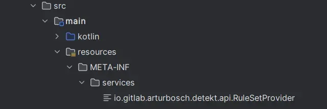
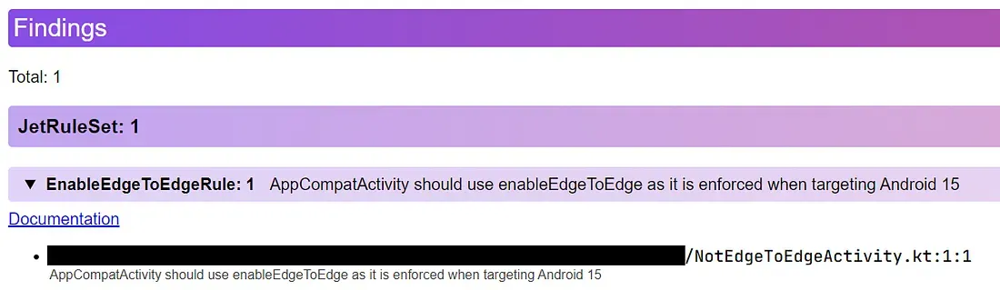

> [This post was originally published on the Just Eat Takeaway blog](https://medium.com/justeattakeaway-tech/extending-detekt-for-android-at-jet-1236bd1d16ce)

For some time now, the JET Android Consumer App has been heavily relying on [detekt](https://github.com/detekt/detekt) for static code analysis.

The default rules detekt comes with are, by nature, generic enough to serve most projects. But there are times when we need to be more specific in order to:

-   Help steer the “ship” in the right direction
-   Remove the need of humans catching issues at review time

Let’s have a look at a specific rule, then.

### Supporting edge-to-edge enforcement

Apps are edge-to-edge by default on devices running Android 15 if the app is targeting Android 15.

Most devs would not be aware of this change, neither are they expected to be. To convey this, we want to accomplish two things:

-   Make sure all existing classes extending `AppCompatActivity` are calling `enableEdgeToEdge`
-   Prevent any future activities from being created without it

Detekt has a very in-depth API, but simply reading the text of a file with `override fun visitKtFile` does the trick here.

```kotlin
class EnableEdgeToEdgeRule(config: Config) : Rule(config) {

    override val issue = Issue(
        javaClass.simpleName,
        Severity.Defect,
        EDGE_TO_EDGE_MESSAGE,
        Debt.TWENTY_MINS
    )

    override fun visitKtFile(file: KtFile) {
        super.visitKtFile(file)

        if (file.text.contains("AppCompatActivity()") && !file.text.contains("enableEdgeToEdge()")) {
            report(
                CodeSmell(
                    issue = issue,
                    entity = Entity.from(file),
                    message = EDGE_TO_EDGE_MESSAGE
                )
            )
        }
    }
}

internal const val EDGE_TO_EDGE_MESSAGE = "AppCompatActivity should use enableEdgeToEdge as it is enforced when targeting Android 15"
```

*EnableEdgeToEdgeRule.kt*

### How does this even work?

All the rules, like the one above, are placed inside a module called `detekt-custom-rules`.

It is a plain library project, relying on the detekt plugin and the `detekt-api` library. Its job is to provide the custom rules to the rest of the project.

```kotlin
plugins {
    kotlin
    id("io.gitlab.arturbosch.detekt")
}

dependencies {
    compileOnly(libs.kotlin)
    compileOnly("io.gitlab.arturbosch.detekt:detekt-api:<version>")
}
```

*build.gradle.kts*

### Defining the rule set

Rules are added in an implementation of `RuleSetProvider`:

```kotlin
class JetRuleSetProvider : RuleSetProvider {
    override val ruleSetId: String = "JetRuleSet"

    override fun instance(config: Config): RuleSet {
        return RuleSet(
            ruleSetId,
            listOf(
                EnableEdgeToEdgeRule(config)
            ),
        )
    }
}
```

*JetRuleSetProvider.kt*

### Registering the provider

Detekt uses the `ServiceLoader` pattern to collect all instances of `RuleSetProvider` interfaces.

The `resources/META-info/services/io.gitlab.arturbosch.detekt.api.RuleSetProvider` file has only one line in it, pointing to the implementation:

```
com.jet.detektcustomrules.JetRuleSetProvider
```



### Sharing this to the rest of the project

-   Apply the `detekt-custom-rules` library via the `detektPlugins` syntax
-   Point detekt to the yml file where all the rules are defined.

```kotlin
dependencies {
    detektPlugins(project(":detekt-custom-rules"))
}

detekt {
     config.setFrom(file("config/detekt/detekt.yml"))
}
```

*build.gradle.kts*

### The detekt.yml file

```yaml
JetRuleSet:
    EnableEdgeToEdgeRule:
        active: true
```

*detekt.yml*

### In action

Locally running `<module>:detekt` on a module with an “offending” activity, the HTML report confirms that the rule is working ok.



For CI, [`danger-kotlin`](https://github.com/danger/kotlin) is used to post this exact message as a comment on pull requests.

### Unit testing rules

It’s fair to say that most devs are not very familiar with the detekt APIs. And while detekt is powerful, it’s also quite arcane.

It’s no surprise that it takes a lot of attempts to write a new rule that works as intended. Fortunately, the testing library allows for quick iteration.

```kotlin
class EnableEdgeToEdgeRuleTest {
    @Test
    fun `should report when edgeToEdge is not used`() {
        val code = """
            class A : AppCompatActivity() {
                fun foo() {

                }
            }
        """
        val findings = EnableEdgeToEdgeRule(Config.empty).compileAndLint(code)
        assertEquals(
            findings[0].message,
            EDGE_TO_EDGE_MESSAGE
        )
    }
}
```

*EnableEdgeToEdgeRuleTest.kt*

### But wait, there is more

The JET Android app has plenty more rules like this one. For example:

-   Preventing usages of `android.util.Log` and `GlobalScope` in favour of custom implementations
-   Preventing activities overriding `onBackPressed()`, in order to support predictive back animations
-   Enforcing usage of custom annotations for Dagger2
-   And a few other esoteric rules that would make no sense for people outside this project 😅


### Deprecating ourselves

The road to removing the need for human reviewers is nothing new. Lint has been doing that for years now, as well as 100s of other tools out there.

There is only so much detekt can do since the rules themselves are written, hastily most of the time, by humans. Still, it’s a much better alternative than relying on the right person catching issues at review time.

Hope you found this somewhat useful.

Cheers 👋
