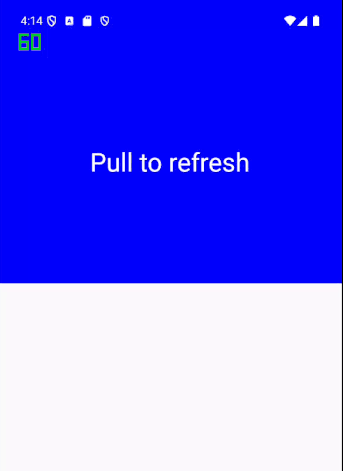
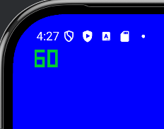
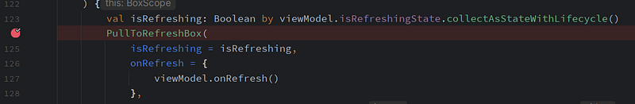
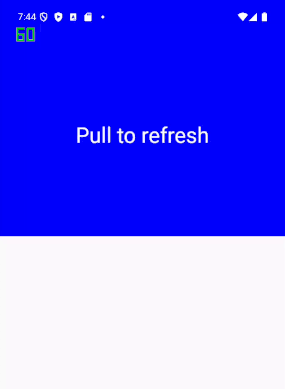
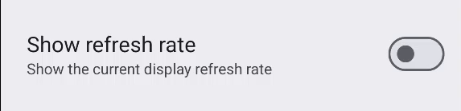
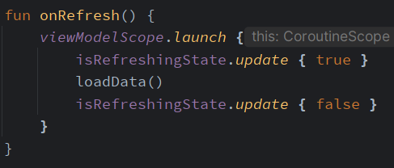

As part of my daily attempt to pay the bills, I had to implement some pull-to-refresh action.

For the uninitiated, the pull-to-refresh component allows users to drag downwards at the beginning of an app’s content to refresh some data.

Kind of like this:


#### Enhance

While the pattern is quite common, it’s not exactly something one does on the day-to-day.

So, I went ahead and blatantly copied the [official docs](https://developer.android.com/develop/ui/compose/components/pull-to-refresh).

<!-- https://gist.github.com/CostaFot/77857778ecac23f498951cd7e0cc6e3f -->

```kotlin
@Composable
private fun MainScreen(
    viewModel: PullToRefreshViewModel = hiltViewModel()
) {
    Box(
        modifier = Modifier
            .fillMaxWidth()
            .background(Color.Blue)
    ) {
        val isRefreshing: Boolean by viewModel.isRefreshingState.collectAsStateWithLifecycle()
        PullToRefreshBox(
            isRefreshing = isRefreshing,
            onRefresh = {
                viewModel.onRefresh()
            },
        ) {
            // ....
        }
    }
}
```

The `PullToRefreshViewModel` holds the loading state and has a refresh function to test things out.

<!-- https://gist.github.com/CostaFot/23aab4097c9542a59d2d11d6275f678c -->

```kotlin
@HiltViewModel
class PullToRefreshViewModel @Inject constructor() : ViewModel() {
    val isRefreshingState = MutableStateFlow(false)
    fun onRefresh() {
        viewModelScope.launch {
            isRefreshingState.update { true }
            isRefreshingState.update { false }
        }
    }
}
```

This is innocent enough, right?

#### Hol’ up

When I tried it out, to my surprise, the pull-to-refresh indicator was getting **completely stuck**. It would not leave the screen!



One would expect it to spin a bit, then hide. Or just hide immediately.

But getting stuck was not in the cards.

#### Wait, why is the frame rate indicator turned on?



This will hopefully be apparent by the end of this post.

Successful guesses win a [Kodee plush](https://blog.jetbrains.com/kotlin/2023/04/the-kotlin-mascot-returns/) limited edition. (lie)

#### Is this a bug?

My first thought was that this is a bug on the [`PullToRefreshBox`](https://developer.android.com/reference/kotlin/androidx/compose/material3/pulltorefresh/package-summary#PullToRefreshBox%28kotlin.Boolean,kotlin.Function0,androidx.compose.ui.Modifier,androidx.compose.material3.pulltorefresh.PullToRefreshState,androidx.compose.ui.Alignment,kotlin.Function1,kotlin.Function1%29) side of things. As always, it’s never my fault.

Just to check, I put a breakpoint on the debugger and tried again.



This breakpoint was never being hit when I was initiating the pull-to-refresh action. `isRefreshing` was never `true`! 😵

#### How is this even possible?

Ok, so the `StateFlow` is clearly being updated to `true` first, then to `false`. What am I missing?

<!-- https://gist.github.com/CostaFot/23aab4097c9542a59d2d11d6275f678c -->

```kotlin
@HiltViewModel
class PullToRefreshViewModel @Inject constructor() : ViewModel() {
    val isRefreshingState = MutableStateFlow(false)
    fun onRefresh() {
        viewModelScope.launch {
            isRefreshingState.update { true }
            isRefreshingState.update { false }
        }
    }
}
```

Since this made no sense, I decided to put a 2000_ms_ delay and gave it another go:

<!-- https://gist.github.com/CostaFot/a07eed85ba5286318eaf735ef1400bff -->

```kotlin
fun onRefresh() {
    viewModelScope.launch {
        isRefreshingState.update { true }
        delay(2000) // simulate loading
        isRefreshingState.update { false }
    }
}
```

The indicator now animates correctly, then disappears after 2000_ms_.



#### But why does it work now?

On a 60 Hz refresh rate phone, the screen refreshes 60 times per second.



*the refresh rate indicator can be turned on in developer options*

> 60 Hz, the UI can update at most every 16.67 ms

> 144 Hz, the UI can update at most every 6.94 ms

If updates are emitted faster than the frame duration, compose will skip **intermediate** updates and only process the **latest** value for the next frame.

[Sven Bendel](https://medium.com/u/4fcaefd1f0f9) was kind enough to provide a way more detailed explanation than I could have ever come up with. You can read it [here](https://ubuntudroid.medium.com/thanks-for-the-write-up-0035517261c9). 🫡

So, in this case:



-   On a 60 Hz device
-   `loadData` takes 1_ms_ to complete, for example
-   compose **skips** the intermediate update of `true`, and only processes the latest `false` value

The crux of the issue is that [`PullToRefreshBox`](https://developer.android.com/reference/kotlin/androidx/compose/material3/pulltorefresh/package-summary#PullToRefreshBox%28kotlin.Boolean,kotlin.Function0,androidx.compose.ui.Modifier,androidx.compose.material3.pulltorefresh.PullToRefreshState,androidx.compose.ui.Alignment,kotlin.Function1,kotlin.Function1%29) animates and hides the indicator properly **only** when toggling `isRefreshing` in a serial manner — first to `true` then to `false`.


#### Update

While [Material3 v1.4.0-alpha01](https://developer.android.com/jetpack/androidx/releases/compose-material3#1.4.0-alpha01) fixes this specific issue with `PullToRefreshBox`, (thanks for pointing it out [Florent Guillemot](https://medium.com/u/d25c9444e1aa) 🙏), the premise of this problem is the same when writing any composable.

The compose layer is **not** guaranteed to receive **all** updates, if they happen _way_ too fast.

While this seems self-evident now after debugging through this, it was definitely **not** evident when I spent almost 2 hours going mad with this. 🤣

---

#### So, what do?

If one is in the unfortunate position of trying to fix this type of bug, we need a way to:

-   Guarantee delivery of **all** values of a `StateFlow` to the compose layer — no matter how quickly it’s being updated
-   Make it refresh rate fool-proof — no one wants to bother with checking what refresh rate a device has programmatically
-   Make it a bit generic

A `StateFlow` that will put some delay in between emissions should do. 50_ms_ sounds more than enough.

<!-- https://gist.github.com/CostaFot/1d6781651bf76733c899e50ad4e0e6f4 -->

```kotlin
private class CooldownStateFlow<T>(
    initialValue: T,
    private val coroutineScope: CoroutineScope,
    dispatcher: CoroutineDispatcher,
    private val cooldownMillis: Long = 50L,
) {
    private val singleThreadDispatcher = dispatcher.limitedParallelism(1)
    private val _events =
        MutableSharedFlow<T>().also {
            coroutineScope.launch(singleThreadDispatcher) {
                it.collect { value -> 
                    _stateFlow.update { value }
                    delay(cooldownMillis)
                }
            }
        }
    private val _stateFlow = MutableStateFlow(initialValue)
    val stateFlow = _stateFlow.asStateFlow()

    fun update(value: T) {
        coroutineScope.launch(singleThreadDispatcher) {
            _events.emit(value)
        }
    }
}
```

This is extremely hacky, but hey, I don’t make the rules.

#### Anyways

Hope you found this somewhat useful.

@ [markasduplicate](https://twitter.com/markasduplicate)

Later.
