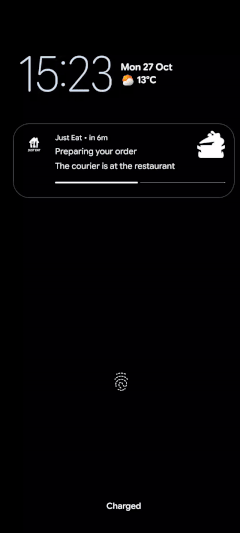
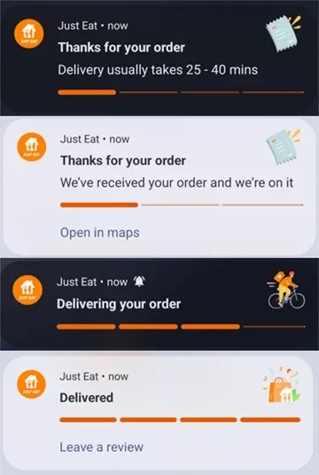
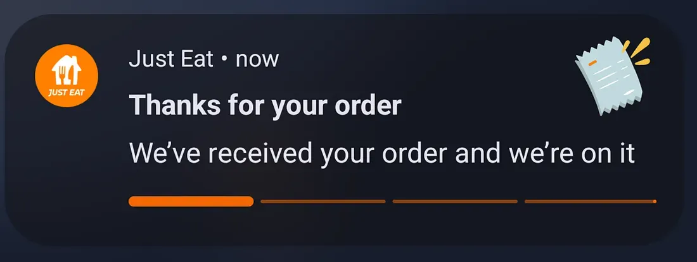
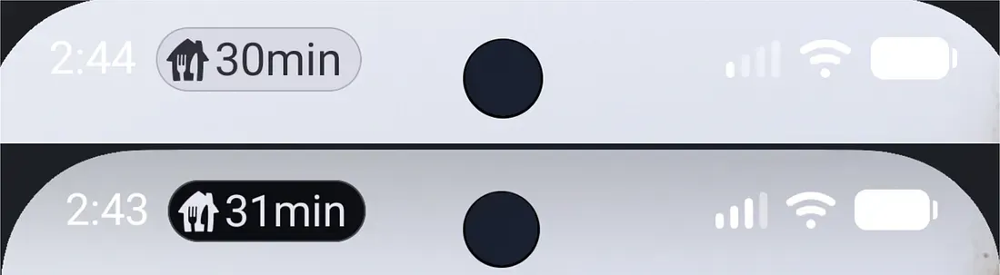
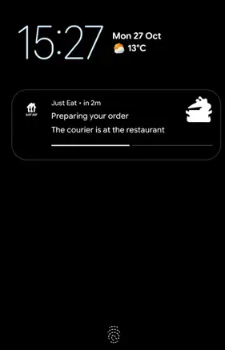
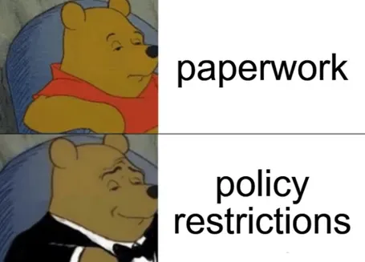
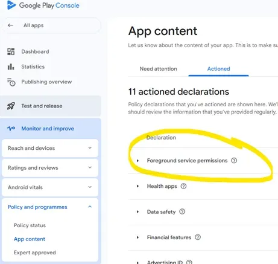

> [This post was originally published on the Just Eat Takeaway blog](https://medium.com/justeattakeaway-tech/live-updates-and-progress-notifications-for-android-16-at-jet-b0c87eab17b4)

Android 16 introduced a new notification template specifically designed to help users seamlessly track user-initiated start-to-end journeys.

These are known as [progress-centric notifications](https://developer.android.com/about/versions/16/features/progress-centric-notifications), which offer upgraded visibility on system surfaces and top ranking in the notification drawer.

This functionality immediately stood out as ideal for the android apps we build at Just Eat Takeaway.com, so we got right on adopting it.

But first, the end result in action:



### Key metrics

Progress notifications drive a significant 22% increase in post-order screen views. Users are engaging with the notification **a lot**.

Initially, a primary concern was the potential for immediate user dismissal, which would have indicated that the notifications weren’t useful. However, the exact opposite happened. Users are keeping the notification present for an **average of 38 minutes**, which closely aligns with the duration of a typical order.

Building on that retention, **42% of users** are keeping the progress notification active through the _entire_ order flow until completion. Seeing nearly half of our user base maintain a notification for that duration is an unexpectedly high engagement rate.

Finally, this sustained attention pays off at the end of the journey. When the order completes, **1.22% of users** click the prompt to leave a review for their order. While that might sound like a small fraction, at our scale, it translates to thousands of additional reviews — directly hitting a core target for the business.

Let’s have a look at this new functionality and how we implemented it.



### Preface

While going through the docs, I got a bit mixed up by the seemingly distinct new types of notifications: [progress-centric](https://developer.android.com/develop/ui/views/notifications/progress-centric) and [live update](https://developer.android.com/develop/ui/views/notifications/live-update).

The simplest way to think about it is that, with a couple of lines of code, a `progress-centric` notification can be “upgraded” into a promoted `live update` notification.

Promoted notifications appear more prominently on system surfaces, including at the top of the notification drawer and the lock screen, and as a chip in the status bar.

> Live update functionality is available on the latest Android 16 QPR beta build

### Progress-centric notifications



The only distinction with normal notifications is the progress bar at the bottom.

To achieve this effect, we build a list of [segments](https://developer.android.com/reference/kotlin/androidx/core/app/NotificationCompat.ProgressStyle.Segment), then attach the style to the notification builder:

```kotlin
fun NotificationCompat.Builder.progressStyleNotification(context: Context) {
    val segmentColor = ContextCompat.getColor(context, R.color.jet_brand)
    val segments = List(4) { NotificationCompat.ProgressStyle.Segment(25).setColor(segmentColor) }
    setStyle(
        NotificationCompat
            .ProgressStyle()
            .setStyledByProgress(true)
            .setProgressSegments(segments)
            .setProgress(25)
    )
}
```

*progressStyleNotification.kt*

### Careful!

The system will [automatically](https://cs.android.com/android/platform/superproject/main/+/main:frameworks/base/core/java/android/app/Notification.java;l=11862) try to apply contrast for the segment colours, if needed.

Not **all** colours will look good, which makes the new style a bit limiting, especially branding-wise.

> We have been told that discussions are still ongoing on this front at Google, and that this might change in the future

Until then, carefully selecting a high-contrast, strong colour is advised.

### Promoting to a Live update

Now that we have a progress-centric notification working, we turn it into a live update by:

1.  Adding the [`POST_PROMOTED_NOTIFICATIONS`](https://developer.android.com/reference/android/Manifest.permission#POST_PROMOTED_NOTIFICATIONS) permission in the manifest
2.  Adjusting the notification builder
3.  Using `setShowWhen` + `setWhen` based on information about the current order from the backend

```kotlin
NotificationCompat
.Builder(...)
.apply {
    setOngoing(true)
    setRequestPromotedOngoing(true)
    setShowWhen(true)
    setWhen(... future ETA in long format ...)
}
```

*liveupdate.kt*

The result:



It’s also worth mentioning that the system will automatically start counting down this time—which takes the heavy weight of doing this manually ourselves. 🫡

The notification also gets a cool new look on the lock screen!



### Careful!

If `setWhen` is set, it should always point to a future time — otherwise the notification update will be **skipped** by the system.

### Tying all this together

We want to represent an activity that is actively in progress, with a distinct start and end. (a typical order takes less than an hour to complete)

[`WorkManager`](https://developer.android.com/develop/background-work/background-tasks/persistent) sounds like the perfect solution for this type of long-running operation. Plus, it handles notifications via [`setForeground`](https://developer.android.com/reference/kotlin/androidx/work/CoroutineWorker#setforeground).

```kotlin
internal class LiveUpdateWorker(..) : CoroutineWorker(..) {
    override suspend fun doWork(): Result {
        // ..
        repository.orderStatusFlow.collect { orderStatus ->
            setForeground(
                ForegroundInfo(
                    "notificationId",
                    buildNotification(orderStatus),
                    ServiceInfo.FOREGROUND_SERVICE_TYPE_SPECIAL_USE,
                )
            )
        }
        // ..
    }
}
```

*worker.kt*

We also needed to go through all the necessary work dealing with [foreground service restrictions](https://support.google.com/googleplay/android-developer/answer/13392821), which require the appropriate foreground service type in the manifest.

[Special use](https://developer.android.com/about/versions/14/changes/fgs-types-required#special-use) type seemed like the only right choice, as the other types did not really apply to our use-case.

(maybe `delivery` will be available in the future? 😊)

```xml
<manifest>
    <application>
        <service
            android:name="androidx.work.impl.foreground.SystemForegroundService"
            android:enabled="true"
            android:exported="false"
            android:foregroundServiceType="specialUse"
            <property
                android:name="android.app.PROPERTY_SPECIAL_USE_FGS_SUBTYPE"
                android:value="<.....>" />
        </service>
    </application>
</manifest>
```

*AndroidManifest.xml*

After declaring permissions and service type in the manifest, we had a build ready for publishing on Google Play.



### Careful!

It quickly became apparent that builds with new foreground services are, by default, blocked on Google Play — until the foreground service types are declared in a new declaration on the App content page.

There is also no way of completing this declaration before uploading the build, which results in a bit of a catch-22.

The required workflow is to:

1.  Upload the build and let it get flagged on purpose.
2.  Complete the newly visible declaration form.
3.  Resubmit the app for approval.



Since we were not familiar with the process, this initially disrupted the release cadence, as we had to quickly revert the changes and push the feature back for a release cycle. Oh, well.

### Wrap up

All in all, judging by the positive engagement numbers, this feature is definitely worth adopting. Looking forward to future iterations.

Hope you found this somewhat useful.

Thanks to Aaron Labiaga @ Google for [featuring this article](https://www.linkedin.com/posts/androiddev_just-eat-takeawaycom-implemented-android-activity-7395222892218626048--G59?utm_source=share&utm_medium=member_desktop&rcm=ACoAABqlRqoBpylN_F-HTL_acOTk0L-BvsX4Eds). 🙏
