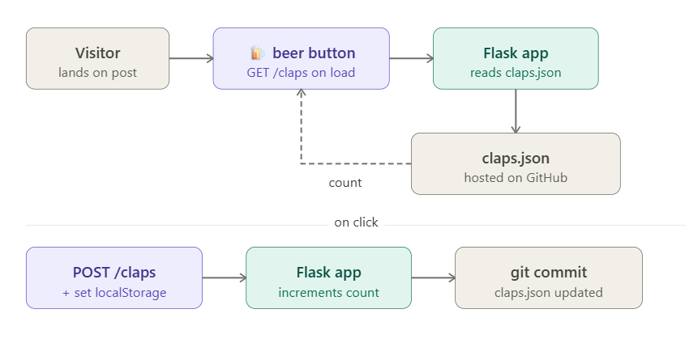

I needed some type of like/clap counter for my blog. But then again, likes are lame. What I _really_ needed was a **beer** 🍺 counter.

The problem is, I'm allergic to anything that resembles real backend work on a silly weekend project. So I used json file as a database, of course.

### TL;DR



### The backend

Our little [Flask app backend](https://github.com/CostaFot/claps-api/blob/main/app.py) exposes two endpoints — GET and POST `/claps` :

<!-- https://gist.github.com/CostaFot/e81ea3b67115f752b170691f42a04c4b -->

```
@app.route("/claps", methods=["GET"])
def get_claps():
    data, _ = get_claps_file()
    key = normalise_url(request.args.get("url"))
    return jsonify({"claps": data.get(key, 0)})

@app.route("/claps", methods=["POST"])
def add_clap():
    data, sha = get_claps_file()
    key = normalise_url(request.args.get("url"))
    data[key] = data.get(key, 0) + 1
    save_claps_file(data, sha)
    return jsonify({"claps": data[key]})
```

Each clap commits an updated [`claps.json`](https://github.com/CostaFot/claps/blob/main/claps.json) to the repo.

### Why this is a terrible idea, actually

GitHub's API has a rate limit of **5,000** requests per hour for authenticated requests. But it's not just claps burning through that budget — every page load does a `GET` to fetch the current count too.

-   **Page load** = 1 request (`GET` claps.json)
-   **Clap** = 2 requests (`GET` to read the current `sha` + `PUT` to commit)

At a – very generous – 5% clap rate we've got roughly **~4,500 page loads per hour** before GitHub starts bouncing. I don't know about you, but I am not getting these kinds of numbers just yet. 😊

The slightly bigger problem is the race condition. Every `POST` does _read_ → _increment_ → _write_. If two requests arrive simultaneously:

1.  Both read the same count and the same `sha`
2.  Both try to commit — GitHub will reject the second one with a 409 Conflict (SHA mismatch)
3.  That raises an unhandled exception → 500 error, clap is lost 😭

A real backend would use database operations. Oh well.

### The frontend

The button is injected via Ghost's [`code injection`](https://ghost.org/tutorials/use-code-injection-in-ghost/). It finds the share bar, inserts itself right below it, and fetches the current count on load.

On click, it sends a POST, stores the clap in `localStorage` so the same browser can't clap twice (no cheating!) and shows a random first-clap message.


There's also a silly easter-egg when clicking again. Try it out at the end of this post. 👇(shameless)

The text also fades in and out via a CSS transition so that it doesn't _just_ snap. That probably took me about 50 attempts to get right. I am not a web dev.

### Anyways

Hope you found this somewhat useful.

[@markasduplicate](https://x.com/markasduplicate?ref=costafotiadis.com)
