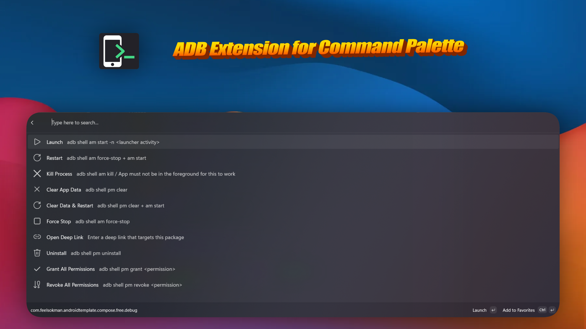
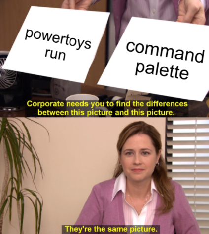

It took more than a decade, but I finally got tired of running the same five ADB commands. Clear app data, force stop, restart the app, you know the ones. You also know the workflow: open terminal, hit `↑` seventeen times, squint, hit `↑` three more times, run it, forget the package name, open another terminal, hit `↑` again.

I've been a heavy user of [Command Palette](https://learn.microsoft.com/en-us/windows/powertoys/command-palette/overview) for the past few months, so I thought — hell, I can spare an hour or two to extend it and never touch the terminal again.


### TL;DR

Introducing [**ADB extension for Command Palette**](https://github.com/CostaFot/AdbExtension). Type `adb`, pick an app/pick an action and voila!



I also published it on the Microsoft Store + Winget. I wasted so many hours on this, might as well.

[](https://get.microsoft.com/installer/download/9nhdx4xwcngs?referrer=appbadge)

`winget install --id CostaFotiadis.ADBExtensionforCommandPalette`

### What is Command Palette?

If you're on macOS you have Spotlight, [Raycast](https://www.raycast.com/) or Alfred — hit a hotkey, type anything, things happen. On Windows we've actually had options for a while too: [Flow Launcher](https://www.flowlauncher.com/), Raycast and a bunch of others I'm missing.

And of course [PowerToys Run](https://learn.microsoft.com/en-us/windows/powertoys/run), which is what I had been using for the past few years.

**Command Palette** is Microsoft's newer, nicer take — a searchable palette, and — crucially for this post — **an extension model**. It allows for anyone to add more functionality on top of it. The palette discovers them, indexes them, and runs them.



### The extension model

An extension is a WinUI/C# class library that exposes a `CommandProvider`. The provider returns top-level items. Items can either **run an `InvokableCommand`** or **navigate into a `Page`**. Pages are lists. Lists contain items. Items contain... you see where this is going.

```csharp
internal sealed partial class ClearAppDataCommand : InvokableCommand
{
    private readonly string _packageName;

    public ClearAppDataCommand(string packageName)
    {
        _packageName = packageName;
        Name = "Clear App Data";
    }

    public override ICommandResult Invoke()
    {
        AdbHelper.RunAdb($"shell pm clear {_packageName}", out _, out string error);
        return string.IsNullOrEmpty(error)
            ? CommandResult.ShowToast($"Cleared data for {_packageName}")
            : ErrorToast($"Failed to clear data: {error}");
    }
}
```

*ClearAppDataCommand.cs*

That's the whole pattern basically, 18 times, with different `shell` invocations. 🧌

### Shelling out to `adb.exe`

Since I am clueless, I didn't even bother using any proper ADB client libraries for .NET. Just spawn `adb.exe` as a subprocess and read `stdout`/`stderr` like it's 1998.

```csharp
process.Start();
string stdout = process.StandardOutput.ReadToEnd();
string stderr = process.StandardError.ReadToEnd();
process.WaitForExit(); // do NOT move this above the reads
```

*process.cs*

**Why not a library?** Any barely sane person using this most likely has `adb` set on their PATH already. It already handles transport and has the right protocol version for whatever Android build they're on. Why complicate things?


### What's in the box

The usual suspects: clear data, force stop, kill, uninstall, grant / revoke all runtime permissions, toggle animations etc. (full list on the [README](https://github.com/CostaFot/AdbExtension))

The one I use the most: **launch deep link / arbitrary URI**. Deeplinks are a huge PITA.

### I have no idea what I am doing: `ItemsChanged` vs. the constructor

Since I pretend to write Android to pay the bills, Windows framework lifecycles kind of escape me.

**The bug**: the page loads its package list asynchronously and raises `ItemsChanged` when the data arrives. Except the framework only subscribes to `ItemsChanged` _after_ `GetItems` is called for the first time. (android: think of this as an `Activity` that fires `onDataReady()` before `onCreate()` returns)

So if your background task finishes before that subscription is set up, you fire into the void and the page just shows nothing.

**The fix:** intercept the `add` accessor on `INotifyItemsChanged.ItemsChanged` and trigger the data fetch right there — the moment the framework subscribes, you start loading.

```csharp
event TypedEventHandler<object, IItemsChangedEventArgs> INotifyItemsChanged.ItemsChanged
{
    add    { _itemsChanged += value; RefreshPackages(); }  // <-- the whole point
    remove => _itemsChanged -= value;
}
```

*TypedEventHandler.cs*

**Two gotchas**: use `INotifyItemsChanged.ItemsChanged` explicitly, not `IListPage.ItemsChanged` — same name, different interface, framework subscribes via the first one.

Now I was getting alarm bells in my head writing this whole thing and I am _pretty_ sure this is horribly inefficient. But hey, it worked.


### The EXE path is a dead end?

The [extension publishing docs](https://learn.microsoft.com/en-us/windows/powertoys/command-palette/publish-extension-winget) show how to package an extension as an `.exe` with an `Inno Setup` installer.

If you follow along, build, install — the palette does not see your extension. No error. No logs. Nothing. 💢

**First rabbit hole: the registry entries do nothing.** The Inno Setup snippet in the docs is missing `ValueType: string` and `ValueName: ""`. The key gets created, but the default value is empty. PowerToys finds the CLSID but has no idea where the `exe` lives.

The fix:

```ini
Root: HKCU; Subkey: "...\LocalServer32"; ValueType: string; ValueName: ""; \
    ValueData: "{app}\AdbExtension.exe -RegisterProcessAsComServer"
```

**Second rabbit hole: a UAC prompt on install.** `{autopf}` resolves to Program Files, which needs **elevation**. Nobody wants to click through UAC, it just sets off alarm bells.

The fix: Swap to `{localappdata}\AdbExtension` and set `PrivilegesRequired=lowest`.


*typical UAC prompt*

**Third rabbit hole: none of it matters anyway.**

Registry correct. No UAC prompt. Installs cleanly. Still does **not** show up in Command Palette.


Turns out PowerToys doesn't discover extensions by scanning the registry or a folder like you might expect.

It uses a Windows API that exclusively reads from installed MSIX packages — kind of like the Play Store vs sideloading.

If your app wasn't installed through the proper packaging system, Windows doesn't know it exists. An EXE installer is essentially invisible to it, no matter how correctly you set things up.

```csharp
AppExtensionCatalog.Open("com.microsoft.commandpalette").FindAllAsync();
```

I went looking for a fallback through the [PowerToys repo](https://github.com/microsoft/PowerToys/blob/5520ae4cfa59f53f4bd4cffc7a9c3d20c98250ed/src/modules/cmdpal/Microsoft.CmdPal.UI.ViewModels/Models/ExtensionService.cs#L148), but no luck. There _is_ an `AppPackagingFlavor` enum with values like `Unpackaged` which looks promising for about thirty seconds, until you realise it's never consulted during discovery. Maybe later.

**Fourth rabbit hole: Visual Studio was lying to me?** The reason I didn't catch any of this during development is that Visual Studio quietly handles all the MSIX packaging and signing behind the scenes when you hit the Run button.

It's only when you try to ship an actual installer that you realise your dev setup and your production setup are completely different things — which, now that I think about it, is exactly like debug vs release APKs on Android. 🤣

### Just ship an MSIX, right?

To be honest I had no idea what an MSIX was before this. Turns out it's basically Windows' equivalent of an APK — a signed, packaged bundle that the OS knows how to install and verify. And just like Play Store won't accept an unsigned APK, you need a properly signed MSIX if you want to publish anywhere.

The signing options, as far as I can tell:

-   **Buy a code signing cert** — DigiCert, Sectigo and others. ~$100–300/year. (_WHAT?!!_)
-   **Azure Trusted Signing** — Microsoft's own service, ~$10/month. I am registered in way too many things but I guess this works?
-   **SignPath.io** — free tier for genuine open source projects. Apply, wait, maybe get approved.
-   **Microsoft Store** — they sign it for you for free. The catch is you now have to deal with the Microsoft Store.

I went with the Store in the end — it must be a fetish at this point, getting abused by both the Play Store and now the Microsoft Store.

Submit the MSIX, wait for certification, Microsoft signs it. Then you upload the signed MSIX to the GitHub release and point the WinGet manifest at it.


## Anyways

Horribly written C# code of the project can be found [here](https://github.com/CostaFot/AdbExtension). Hope you found this somewhat useful.

[@markasduplicate](https://x.com/markasduplicate)

Later.
