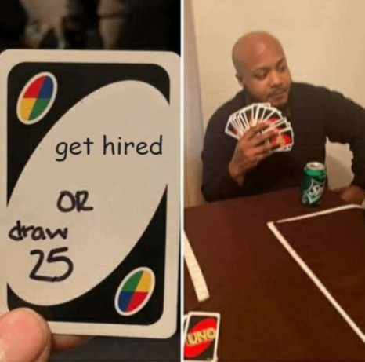
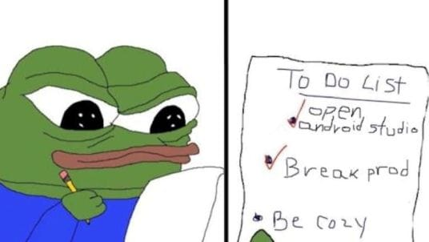

After being part of countless tech interviews, on both sides of the aisle, here's a few things that my much younger, stupider self, would probably refuse to listen to.

## #1. It's all in the game

You might not believe it, but most interviewers out there – whose sole job is **not** to be a professional interviewer – really just **want to hire you.** So they can be done with it, go back to their "normal" work and not have to interview more people.

Think about it – interviews are most likely a net **negative** for the drive-by interviewer**.** There is very little to gain – they already have a job! Tickets are left behind, slack stays unanswered for hours, and they spend half their day trying not to be the reason someone posts about them on twitter.

On the other hand, for the interviewers who woke up on the wrong side of the bed – they will probably reject you no matter what you do. I am sorry, this business is a lot more about feelings than people are willing to admit.

> 🙃 Sometimes, things are just out of your control. Bias cuts both positively and negatively, and you never know which one you are getting until after the fact

## #2. A normal human being

Most people are subconsciously filtering for these:

-   Is this person normal?
-   Do they know the basics?
-   Will my life be easier if this person is around?
-   If I make a comment on their PR, am I going to get in trouble?
-   Can they take a joke?
-   Is there _potential_ here?

The last part is damn **important** if you are interviewing for a junior/mid position. A lot of devs absolutely love showing off. I spent my first few junior years latching onto seniors who were looking for a person who just asks them questions 24/7.

> 🐒 Showing interest is half the battle. When you find good people, you need to show promise, grab onto them hard and not let go

## #3. The technical aspect should come naturally

Most tech interviews are some form of live coding/pair programming/system design/general tech talk or some other **obnoxious** equivalent. No one like this, but it's what we got.

The _technical_ aspect should be second nature by the time you are on an interview. The _human_ aspect is much trickier to navigate, and needs as much spare brain capacity as possible. Being likeable and personable under a high stress situation is really hard.

It is **extremely easy** to spot an individual who has spent hundreds of hours slinging code around trying to build stuff, for themselves or for a company! Familiarity is evident and carries a huge sign for all to see. Your goal is showing that off as soon as possible and get on people's right side.

> There is no shortcut to this. Ah well.

For example – on a live coding session – you would be surprised of the amount of people who never suggest using the debugger when running into problems. I can already hear people scoffing at this, thinking that the debugger is a very basic concept and that it doesn't really mean anything!

I wholeheartedly disagree – if someone is not using the basics, what are we even doing here?

You should be able to:

-   wake up in the middle of the night (even on a drunken stupor 🍺)
-   open the editor of your choice, your favourite project, in your preferred language
-   ..and still be able to write basic syntax, use the available tooling and navigate around it like a pro

> 🚗 Nothing beats having thousands of miles on the keyboard. It will take care of most worries on its own.

## #4. You better get your story straight

If you cannot talk about yourself, then it's all for naught. Your story is what most people will ask in the first 5 minutes of the interview. Even worse, most places will inevitably ask you about a tough situation you were in, how you handled it and what you learnt from it. (I know 🤮)

**Give it the flair it deserves**. Rambling on for 10 minutes aimlessly will **not** serve you. People will check out and wait patiently until you stop talking, then just go through the interview script, trying to make it through until 17:00 so they can go to the pub.

Beats to cover:

-   **Funny turns –** "I was working at a warehouse making silly little websites on the side" _(everyone loves an outsider!)_
-   **Experience –** Funny bugs, crazy rollouts, potential legal takedowns averted and anything out of the ordinary
-   **Education –** Why did you study something? Did you like it? Did you change your mind? How did you end up doing iOS/web/android/plumbing?
-   **No experience?** Talk about your personal projects and what you found interesting. You do know them by heart, right? :)

> 🎭 Practice your story. If it's not interesting to you, it probably won't be for the stranger who cares little about you in the first place

## #5. It is _your_ interview

You got 2 choices:

-   Leave it up to luck and blame AI/weather/life
-   Or... make your own luck

**Cut your losses**. It is impossible to figure out if a job is going to be decent from a 1-2 hour convo. It is **not** your fault if it ends up being a bit shit. You played, lost, and live to play another day.

> 💀 The right job can "make" you for the next decade. You should be ruthless and judge them as much as they are judging you

## Wew lad

Hope you found this somewhat useful.

_(if you liked this post, why not click the_ 🍺 _button below?)_

[@markasduplicate](https://x.com/markasduplicate?ref=costafotiadis.com)

Later.
