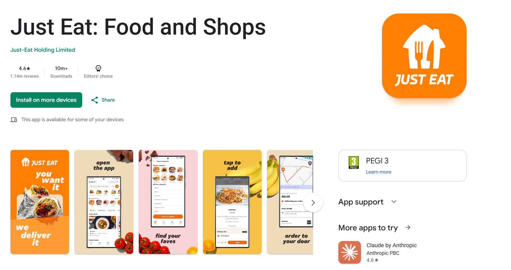

## Just Eat Takeaway.com

**_Mid 2010s_** I thought it would be nice if I got some steady employment so I could reliably pay my rent.

The app(s) go by many names these days – [Just Eat](https://www.just-eat.co.uk/), [Lieferando](https://www.lieferando.de/en), [Thuisbezorgd](https://www.thuisbezorgd.nl/) and a bunch of others.

At the time of writing the JET apps serve about a 100 million users.

The trick in writing a nice android app is making it extensible for:

-   migrations
-   buyouts
-   mergers
-   new markets
-   abandoned markets (!)
-   ....and all sorts of corporate takeovers

The JET android app mono-repo has been through quite a few of those throughout the years. 🫡
