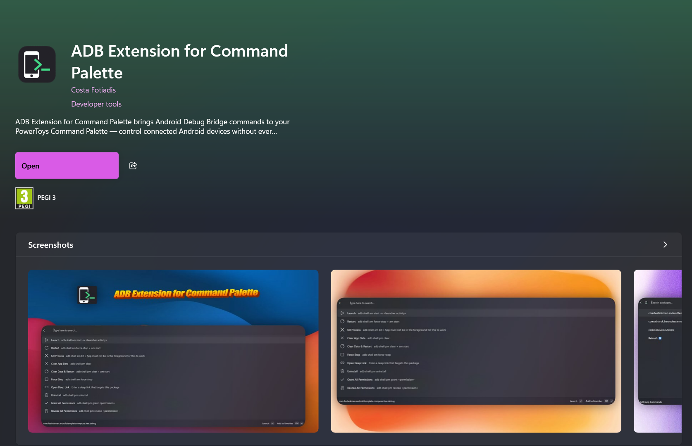
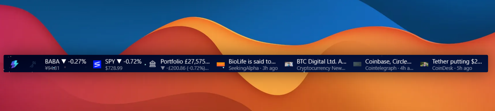
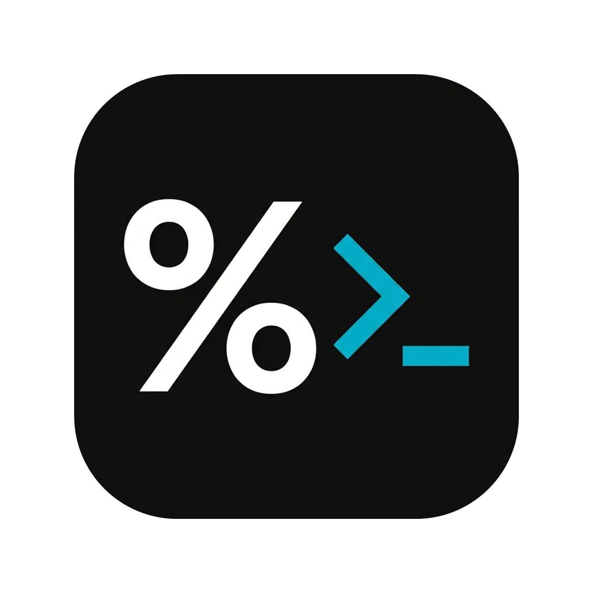

## Just Eat Takeaway.com

**_Mid 2010s_** I thought it would be nice if I got some steady employment so I could reliably pay my rent.

The app(s) go by many names these days – [Just Eat](https://www.just-eat.co.uk/), [Lieferando](https://www.lieferando.de/en), [Thuisbezorgd](https://www.thuisbezorgd.nl/) and a bunch of others.

At the time of writing the JET apps serve about a 100 million users.

The trick in writing a nice android app is making it extensible for:

-   migrations
-   buyouts
-   mergers
-   new markets
-   abandoned markets (!)
-   ....and all sorts of corporate takeovers

The JET android app mono-repo has been through quite a few of those throughout the years. 🫡

## ADB Extension for Command Palette

A Windows 11 Command Palette extension (PowerToys) for Android devs. Exposes common ADB operations directly from the command palette.

Wrote this cause I kept repeating the same ADB commands on the terminal.

See the dedicated blog post here:

> **[Building a PowerToys Command Palette Extension](/it-looks-like-youre-trying-to-build-an-extension-for-command-palette/)**
> How to build a PowerToys Command Palette extension in C#: the extension model, ItemsChanged vs. the constructor, shelling out to adb.exe, and why the EXE path is a dead end (ship an MSIX).

## Markets Extension for Command Palette

A Windows 11 [Command Palette](https://learn.microsoft.com/en-us/windows/powertoys/command-palette/overview) (PowerToys) extension for **stock, crypto, and currency** market data.

> **[GitHub - CostaFot/MarketExtension](https://github.com/CostaFot/MarketExtension)**
> Contribute to CostaFot/MarketExtension development by creating an account on GitHub.

## Agents Panel for Command Palette

A Windows 11 [Command Palette](https://learn.microsoft.com/en-us/windows/powertoys/command-palette/overview) extension that shows your AI agents' usage on the Command Palette dock.

> **[GitHub - CostaFot/agents-panel-extension](https://github.com/CostaFot/agents-panel-extension)**
> Contribute to CostaFot/agents-panel-extension development by creating an account on GitHub.

## Flagstone

A primitive feature management tool.

> **[GitHub - CostaFot/flagstone](https://github.com/CostaFot/flagstone)**
> Contribute to CostaFot/flagstone development by creating an account on GitHub.

I use it for my own personal projects in order to turn stuff on/off without worrying about distribution on Microsoft Store/Google Play etc.

It is a simple [ktor](https://ktor.io/) app on [Railway](https://railway.com/).

In the end, it's all just a json file, eh? 😊
