_This is a kind-of a sequel of the “_**_Android RxJava in 5 minutes_**_” article I wrote a while back and has stuff that you might find useful for this one._

_You can find it here:_

> **[Android RxJava in 5 minutes](/android-rxjava-in-5-minutes/)**
> These go(o)gles do noffing!

---

Research says that 50% of what you need to know as an android dev is displaying a list of something on the screen. In the olden days populating that list and updating it was just meh.

In comes _ViewModel + DiffUtil_, Google’s kind of successful effort trying to fix the mess that Android is.

So that’s what we gonna do I guess.

Source code in 3 simple files can be found here:

> **[CostaFot/android--rx--project](https://github.com/CostaFot/android--rx--project)**
> Contribute to CostaFot/android--rx--project development by creating an account on GitHub.

### What you will need

Just click _File -> New_ project in Android Studio 3 and include Kotlin support, Android X artifacts and an empty activity pre-made. Press next on everything. Jetbrains really understands its market (monkeys banging the keyboard like me) and basically writes everything for you these days.

Let the thing finish building.

### Dependencies

Go to the _build.gradle (Module: app)_ file in the dependencies block. It should have these lines in it at least:

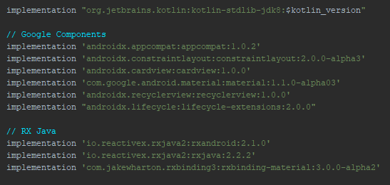

### The adapter

Getting an adapter working with **_DiffUtil_** will spare you from manually updating the _recyclerview_. There’s a bunch of ways to do this but we are gonna go for the easiest one to read since this is the whole point of this.

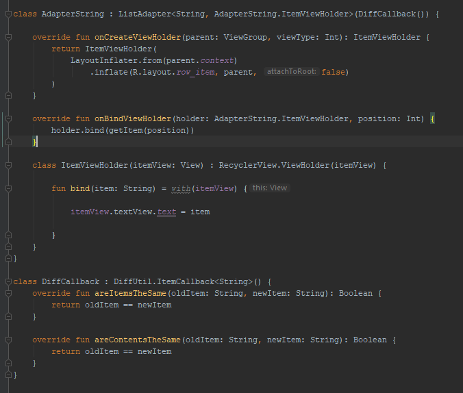

It’s just your run of the mill adapter for a list of strings. The two overridden methods in **_DiffCallback : DiffUtil.ItemCallback<String>_** should be different for more complex objects but this will do for now.

The _row\_item.xml_ can have anything you want. Just need a _textView_ in there anyway.

### The chad ViewModel

Gone are the days of the nightmare that was MVC.

The point of a _ViewModel_ is that he can be paired with an activity and you can throw everything that’s not _UI_ related to him. Tell your activity to observe whatever is interesting that the _ViewModel_ has in it and then act accordingly.

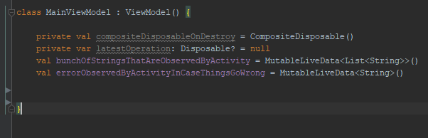

Declaration time. The naming convention is taken to the extreme for simplicity.

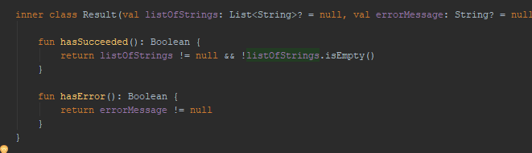

Get this guy in the _ViewModel_ too. He will act as a container for the result of our business logic-madness.

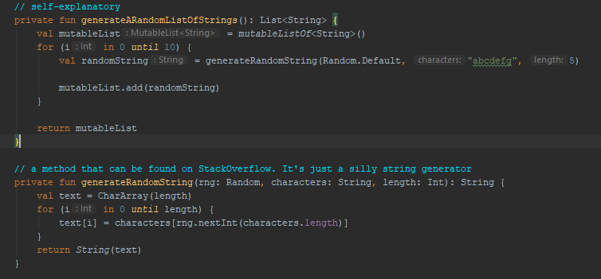

A bunch of methods to generate a random list of strings. This is stuff that you normally stumble upon in the first results when googling. They serve their purpose and they are not the point of this anyway.

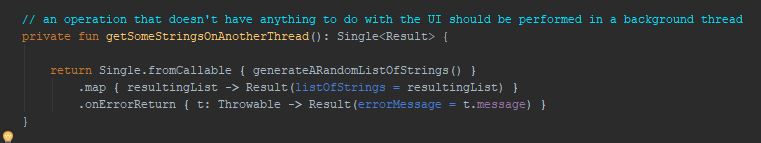

_RxJava_ standard stuff. Generate a list of strings. Convert it into a **_Result_** object. We’ll check later if things went well or not.

---

### The activity

Since you already have a blank **MainActivity**, you should get a layout of some sort to host a _button_ and a _recyclerView_.

Here’s something very sophisticated:

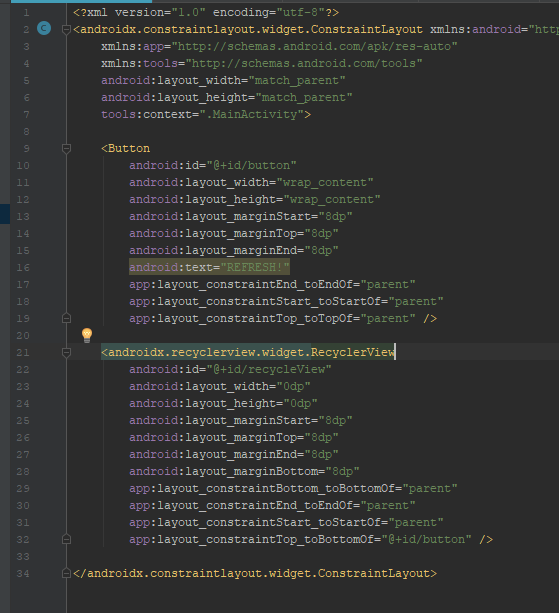

We got the _ViewModel_ and an adapter. Might as well get an activity to house these guys so they don’t live in the streets.

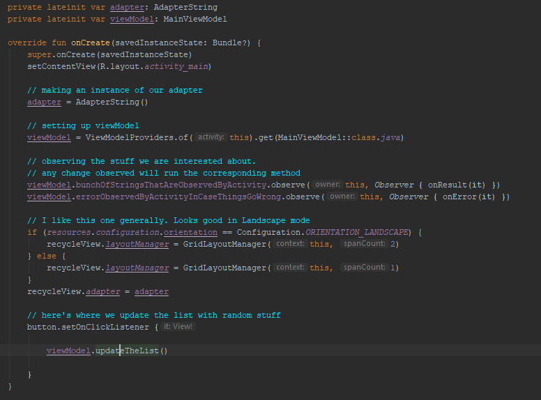

Set everything up as the picture shows. The activity will begin observing both the list of strings and the error message string that was setup in the _ViewModel._

Any changes in those sent via the _postValue (LiveData specific)_ method will go straight in these two methods:

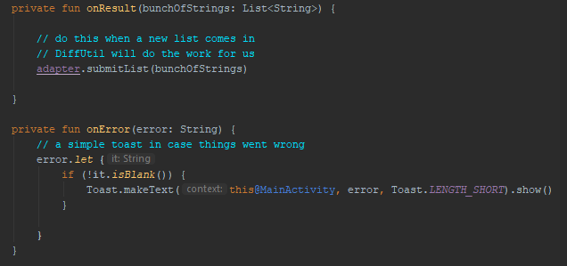

You might have noticed a button with a click listener triggering a method in the _ViewModel_. That’s where the list of strings in the _ViewModel_ will be generated and updated with a _postValue_ method.

Let’s check it out (the comments should provide adequate explanation) :

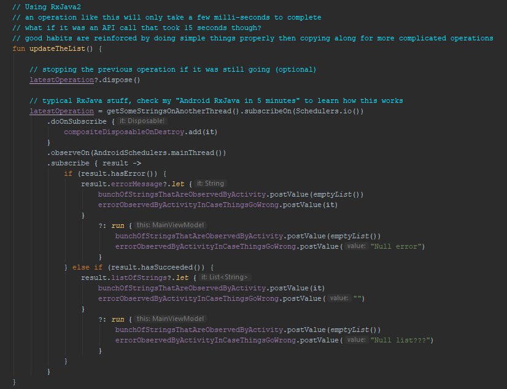

Someone might say that this section is really verbose and long-winded.

> Always code as if the guy who ends up maintaining your code will be a violent psychopath who knows where you live.

The result will have an error if the method to generate the list failed somewhere. This is a classic case when copying things from your google searches and you are not 100% sure how they work.

The result will have succeeded if the list is not null and not empty. That means the random guy on _StackOverflow_ was right.

Now your question will probably be marked as duplicate and down-voted to oblivion.

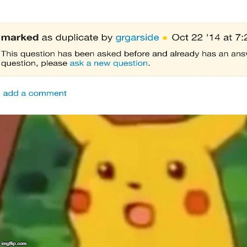

---

It wouldn’t be a _ViewModel_ if the _onCleared()_ method was missing. This method is called when the activity who houses it is destroyed for good. We better clean up after ourselves at that point or else you are risking memory leaks.

A good rule of a thumb is that when are you are doing any asynchronous operations in Android then you should always account for the life-cycle of your activity/fragment/whatever.

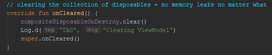

---

### Wew lad

Give this a run and tap the button. The _recyclerView_ should be updated straight away (with default animations too!).

The list itself is a bunch of jibberish and the method that was used to generate it really makes little sense. The difference between the lists is almost guaranteed to be 100% every time as this is truly a random generation of words.

No matter what happens, be it no changes or only 1 item, **DiffUtil** will do the necessary amount of work and you can avoid calling the dreaded _notifyDataSetChanged / notifyItemChanged / etc_ adapter methods.

*noice one mate*

---

_Follow me on Twitter cause my cat ignores me_

> **[Costa (@markasduplicate) | Twitter](https://twitter.com/markasduplicate)**
> The latest Tweets from Costa (@markasduplicate). Marked as duplicate. UK
