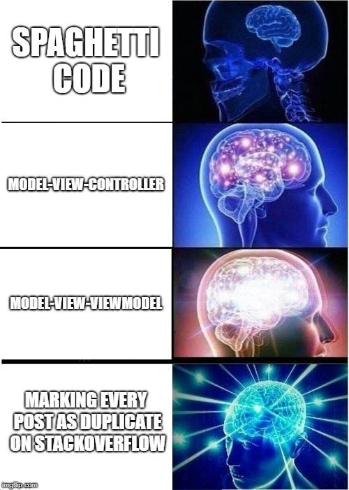

_This is the second mem- ehhh part in the “_👏👏 _Retrofit review_ 👏👏_” series._

_You can find part 1 here:_

> **[👏👏 Retrofit review 👏👏](/retrofit-review/)**
> Or how to use Kotlin + RxJava to get some cats

Source code:

> **[CostaFot/android--retro-electro](https://github.com/CostaFot/android--retro-electro)**
> Contribute to CostaFot/android--retro-electro development by creating an account on GitHub.

---

### Previously on Meme Review

After copy pasting everything like any self respecting Stack Overflow user, we reached a point where everything works.. but looks kind of.. meh.

<!-- https://gist.github.com/CostaFot/e2622691ab75a06d4d30b53efd092e07 -->

```kotlin
class MainActivity : AppCompatActivity() {

    // Read the docs with detailed instructions to get your API key and endpoint!
    // https://docs.thecatapi.com/

    // the server url endpoint
    private val serverUrl = "https://api.thecatapi.com/v1/"
    // this is where you declare your api key
    private val apiKey = "yourApiKeyHere"

    private val compositeDisposableOnPause = CompositeDisposable()
    private var latestCatCall: Disposable? = null

    override fun onCreate(savedInstanceState: Bundle?) {
        super.onCreate(savedInstanceState)
        setContentView(R.layout.activity_main)

        // click listener so you can perform the API call manually
        button.setOnClickListener {
            getSomeCats()
        }
    }

    // the API call
    private fun getSomeCats() {
        // initialising the repository class with the necessary information
        val catsRepository = CatsRepository(serverUrl, BuildConfig.DEBUG, apiKey)

        // stopping the last call if it's already running (optional)
        latestCatCall?.dispose()

        // perform the API call
        // asking for 10 cats. Don't care in what category so just passing null
        latestCatCall =
            catsRepository.getNumberOfRandomCats(10, null).subscribeOn(Schedulers.io())
                .doOnSubscribe {
                    compositeDisposableOnPause.add(it)
                }
                .observeOn(AndroidSchedulers.mainThread())
                .subscribe { result ->
                    when {
                        result.hasError() -> result.errorMessage?.let {
                            Toast.makeText(this@MainActivity, "Error getting cats$it", Toast.LENGTH_SHORT).show()
                        }
                            ?: run {
                                Toast.makeText(this@MainActivity, "Null error", Toast.LENGTH_SHORT).show()
                            }
                        result.hasCats() -> result.netCats?.let {
                            Toast.makeText(this@MainActivity, "Cats received!", Toast.LENGTH_SHORT).show()
                        }
                            ?: run {
                                Toast.makeText(this@MainActivity, "Null list of cats", Toast.LENGTH_SHORT).show()
                            }
                        else -> Toast.makeText(this@MainActivity, "No cats available :(", Toast.LENGTH_SHORT).show()
                    }
                }
    }

    // Killing all background threads (if any exist) cause they don't deserve to live when the activity is not running
    private fun clearAllJobsOnPause() {
        compositeDisposableOnPause.clear()
    }

    // onPause! Stop everything, the user is probably checking memes elsewhere
    override fun onPause() {
        clearAllJobsOnPause()
        super.onPause()
    }
}
```

*Sample activity*

Everything is thrown in the activity 😱!

This is the part where I should explain why this is a horrible way to write but there’s enough internet warriors out there defending good coding practices.

Let’s fix that by introducing a _ViewModel._

The point of a _ViewModel_ is that he can be paired with an activity and you can throw everything that’s not _UI_ related to him. Tell your activity to observe whatever is interesting that the _ViewModel_ has in it and then do your thing.

### Dependencies

Make sure to update the dependencies and give the project a sync afterwards.

<!-- https://gist.github.com/CostaFot/2278aeae57b7dd0039460702e5ddbb6a -->

```groovy
apply plugin: 'com.android.application'
apply plugin: 'kotlin-android'
apply plugin: 'kotlin-android-extensions'
// need this plugin to make this work
apply plugin: 'kotlin-kapt'

android {
   // your android stuff goes here
}

dependencies {
    // auto-generated dependencies
    implementation fileTree(dir: 'libs', include: ['*.jar'])
    implementation"org.jetbrains.kotlin:kotlin-stdlib-jdk7:$kotlin_version"
    implementation 'androidx.core:core-ktx:1.1.0-alpha04'
    testImplementation 'junit:junit:4.12'
    androidTestImplementation 'androidx.test:runner:1.1.2-alpha01'
    androidTestImplementation 'androidx.test.espresso:espresso-core:3.1.2-alpha01'

    // Google Components
    implementation 'androidx.appcompat:appcompat:1.0.2'
    implementation 'androidx.constraintlayout:constraintlayout:2.0.0-alpha3'
    implementation 'androidx.cardview:cardview:1.0.0'
    implementation 'com.google.android.material:material:1.1.0-alpha03'
    implementation 'androidx.recyclerview:recyclerview:1.0.0'
    implementation "androidx.lifecycle:lifecycle-extensions:2.0.0"

    // RX Java
    implementation 'io.reactivex.rxjava2:rxandroid:2.1.0'
    implementation 'io.reactivex.rxjava2:rxjava:2.2.2'

    // Networking
    implementation "com.squareup.retrofit2:retrofit:2.4.0"
    implementation "com.squareup.retrofit2:adapter-rxjava2:2.4.0"
    implementation "com.squareup.retrofit2:converter-gson:2.4.0"
    implementation 'com.squareup.okhttp3:logging-interceptor:3.10.0'
}
```

*Deps*

### CatModel



Let’s just copy pasta the main bits from _MainActivity_ to a _ViewModel_ since we know the code works already as it is.

<!-- https://gist.github.com/CostaFot/c2b656729f611f9ee4699822f4bda5e0 -->

```kotlin
class MainViewModel : ViewModel() {

    private val compositeDisposableOnDestroy = CompositeDisposable()
    private var latestCatCall: Disposable? = null
    // the list that will be observed by the activity
    val bunchOfCats = MutableLiveData<List<NetCat>>()
    // the error message observed
    val errorMessage = MutableLiveData<String>()

    // the API call
    fun getSomeCats() {
        // initialising the repository class with the necessary information
        val catsRepository = CatsRepository(serverUrl, BuildConfig.DEBUG, apiKey)

        // stopping the last call if it's already running (optional)
        latestCatCall?.dispose()

        // perform the API call
        // asking for 10 cats. Don't care in what category so just passing null
        latestCatCall =
            catsRepository.getNumberOfRandomCats(10, null).subscribeOn(Schedulers.io())
                .doOnSubscribe {
                    compositeDisposableOnDestroy.add(it)
                }
                .observeOn(AndroidSchedulers.mainThread())
                .subscribe { result ->
                    when {
                        result.hasError() -> result.errorMessage?.let {
                            // anyone who observes this will be notified of the change automatically
                            errorMessage.postValue("Error getting cats $it")
                        }
                            ?: run {
                                // anyone who observes this will be notified of the change automatically
                                errorMessage.postValue("Null error :(")
                            }
                        result.hasCats() -> result.netCats?.let {
                            // anyone who observes this will be notified of the change automatically
                            bunchOfCats.postValue(it)
                            // clearing the error if it existed (hacky and optional)
                            errorMessage.postValue("")
                        }
                            ?: run {
                                // anyone who observes this will be notified of the change automatically
                                errorMessage.postValue("Null list of cats :(")
                            }
                        else -> {
                            // anyone who observes this will be notified of the change automatically
                            errorMessage.postValue("No cats available :(")
                        }
                    }
                }
    }

    // clearing the collection of disposables = no memory leaks no matter what
    override fun onCleared() {
        compositeDisposableOnDestroy.clear()
        Log.d("TAG", "Clearing ViewModel")
        super.onCleared()
    }
}
```

*CatModel!*

The main difference is the _MutableLiveData_ variables and the _postValue_ method associated with them.

Only thing missing is changing the _MainActivity_ to work with _MainViewModel._

<!-- https://gist.github.com/CostaFot/ddd141e08337955ab7c978d34fdf7a99 -->

```kotlin
class MainActivity : AppCompatActivity() {

    // Read the docs with detailed instructions to get your API key and endpoint!
    // https://docs.thecatapi.com/

    // public static fields in a companion object because im a horrible person
    companion object {
        // the server url endpoint
        const val serverUrl = "https://api.thecatapi.com/v1/"
        // this is where you declare your api key
        const val apiKey = "yourApiKeyHere"
    }
    
    private lateinit var viewModel: MainViewModel

    override fun onCreate(savedInstanceState: Bundle?) {
        super.onCreate(savedInstanceState)
        setContentView(R.layout.activity_main)

        // setting up viewModel
        viewModel = ViewModelProviders.of(this).get(MainViewModel::class.java)

        // observing the stuff we are interested about.
        // any change observed will run the corresponding method
        viewModel.bunchOfCats.observe(this, Observer { onResult(it) })
        viewModel.errorMessage.observe(this, Observer { onError(it) })

        // click listener so you can perform the API call manually
        button.setOnClickListener {
            viewModel.getSomeCats()
        }
    }

    /**
     * Method triggered when we observe a change in MainViewModel.bunchOfCats MutableLiveData
     * @param bunchOfCats An updated list of cats we got from the API
     */
    private fun onResult(bunchOfCats: List<NetCat>) {

        // Not doing anything yet with this list except a toast
        Toast.makeText(this@MainActivity, "Got ${bunchOfCats.size} cats", Toast.LENGTH_SHORT).show()
    }

    /**
     * Method triggered when we observe a change in MainViewModel.errorMessage MutableLiveData
     * @param error Error message describing what went wrong
     */
    private fun onError(error: String) {
        // a simple toast in case things went wrong
        error.let {
            if (!it.isBlank()) {
                Toast.makeText(this@MainActivity, error, Toast.LENGTH_SHORT).show()
            }

        }
    }

}
```

*Cat activity*

---

### Wew lad

Give it a run and tap the button. There should still be a _toast_ popping up telling you what happened (good or bad).

The _MainViewModel_ guy is responsible for the grunt work while the _MainActivity_ is responsible for watching, which come to think of it, is a strange metaphor for most software jobs out there.

Stay tuned for the next part where we will **finally**(!) do something with this list and show these pussycats on the screen with a classic _RecycleView_ and _Glide (for image loading)._


*smash like and subscribe guys new memes every friday*
