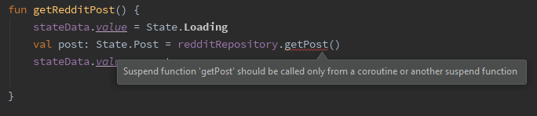

Concurrency on Android has been weird to say the least.

By default, Android handles UI work on the main thread. Any operation that does not “touch” the UI should preferably be off-loaded to someone else.

A lot of effort has gone in fixing that issue in the past: Executors, Handlers, Loaders, RxJava, AsyncTask (R.I.P) and a bunch of others I’m missing.

This post focuses on how to implement coroutines in your project while the next one will be on testing them. (perfect code does not need testing but let’s pretend 🙈)

### Reddit driven development

Most apps out there are based on the same premise.

-   Show a loading animation.
-   Fetch something from somewhere.
-   Show it before the user gets bored and decides to go on Instagram.

Aside from looking at memes all day we might as well write some code.

```kotlin
class PostViewModel(private val redditRepository: RedditRepository) : ViewModel() {

    val stateData = MutableLiveData<State>()

    fun getRedditPost() {
        viewModelScope.launch {
            stateData.value = State.Loading
            val post: State.Post = redditRepository.getPost()
            stateData.value = post
        }
    }
}

sealed class State {
    object Loading : State()
    data class Post(val text: String) : State()
}
```

*GetPost.kt*

We want to end up here somehow. 🤔

One is normally used to crazy RxJava operators or callback shenanigans but this looks like normal blocking code. ಠ\_ಠ

The PostViewModel is responsible for fetching a post from Reddit while the calling activity/fragment is responsible for observing the _stateData_ variable.

### viewModelScope and why should I care

To put it simply, _coroutines_ are _suspend_ functions. They are just like regular functions, only you just need to add the word _suspend_ at the start.

Suspend functions need to be called inside a _coroutineScope_ otherwise the editor will complain.



A scope is like basket where you can put all your coroutines in. Kinda like a C_ompositeDisposable_ if you are familiar with RxJava.

It essentially enforces the monkey banging on the keyb- errr developer to think about memory leaks.


*“B-b-but the documentation says-” — shhh, nobody cares*

The _viewModelScope_ is provided out of the box in the [_androix.lifecycle_](https://developer.android.com/jetpack/androidx/releases/lifecycle) package. It is, by default, running code on the UI thread but the suspend function inside can change that.

Coroutines still running inside this scope will be automatically cancelled when the _onCleared()_ method of the ViewModel is triggered.

Let’s pretend to care about memory leaks and use it then.

### Am I actually going to suspend anything now?

We got this little class inside the PostViewModel that hasn’t been used yet.

```kotlin
class RedditRepository(private val dispatcherProvider: DispatcherProvider) {
    suspend fun getPost(): State.Post {
        return withContext(dispatcherProvider.io) {
            delay(2000)
            State.Post("🐢 SLOW AND STEADY 🐢 WINS THE RACE 🐢 MODS CAN'T BAN ME 🐢 AT THIS PACE 🐢")
        }
    }
}
```

*RedditRepository.kt*

This is like a normal function, except:

-   It’s marked as _suspended_ (needs to run inside a scope).
-   _withContext(dispatcherProvider.io)_ tells the function to run on the IO scheduler.
-   _delay(2000)_ is unique for suspend functions — basically stops the code right there for 2 seconds until it moves on to the next line. Used to simulate an API call that will take a few seconds to complete.

### Why DispatcherProvider?

You can explicitly call the UI thread with _Dispatchers.Main_ or the IO thread (not really one thread but whatever) with _Dispatchers.IO_ but it’s not recommended.

Instead, you should provide dispatchers in the constructor of your class so it can be easily tested later.

Create an interface and an implementation of it to better suit your needs and naming convention — like this one for example.

```kotlin
interface DispatcherProvider {
    val io: CoroutineDispatcher
    val ui: CoroutineDispatcher
    val default: CoroutineDispatcher
    val unconfined: CoroutineDispatcher
}

class DefaultDispatcherProvider(
    override val ui: CoroutineDispatcher = Dispatchers.Main,
    override val default: CoroutineDispatcher = Dispatchers.Default,
    override val io: CoroutineDispatcher = Dispatchers.IO,
    override val unconfined: CoroutineDispatcher = Dispatchers.Unconfined
) : DispatcherProvider
```

*DispatcherProvider.kt*

A _CoroutineDispatcher_ is basically the thread you want to run things on. Using the interface we “rename” the official _Dispatchers.Main_ to _DispatcherProvider.ui ._

### Now what?

Need an activity/fragment to make things work now. Something with a little button to call the PostViewModel method and observe the _stateData_ livedata variable.

```kotlin
  override fun onViewCreated(view: View, savedInstanceState: Bundle?) {
        super.onViewCreated(view, savedInstanceState)

        viewModelpost.stateData.observe(viewLifecycleOwner, Observer { state ->
            when (state) {
                State.Loading -> button.text = "Loading"
                is State.Post -> button.text = state.text
            }
        })

        button.setOnClickListener {
            viewModelpost.getRedditPost()
        }
    }
```

*PostFragment.kt*

That’s it. You are officially on the coroutine bandwagon.

### Careful!

You can actually do this and everything would still work 👺:

```kotlin
 fun getRedditPost() {
        viewModelScope.launch(Dispatchers.Main) {
            stateData.value = State.Loading
            val post: State.Post = redditRepository.getPost()
            stateData.value = post
        }
    }
```

*badGetRedditPost.kt*

This should be avoided as the ViewModel does not need to know or dictate on which thread code runs. (reminder that the viewModelScope runs everything inside in the UI thread unless explicitly told not to).

Inside _viewModelScope_ you should never expect anything to happen “immediately” like you would with normal blocking code_._ It might be still running on the UI thread, or it might not. That is the decision of the suspending functions themselves that know the details of what they are doing.

### Wew lad

Tap the little button and check it out.


Not going to win any design awards but it’s a start.

---


Follow on to the next part:

> **[On testing — Kotlin Coroutines](https://medium.com/@con.fotiadis/on-testing-kotlin-coroutines-d19b69d138f1)**
> Or how to pretend you know what you are doing on pull requests

Source code for the project can be found [here](https://github.com/CostaFot/coroutine-playground).

Later.
