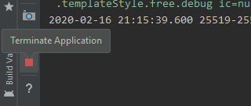

The android framework has a curious case of killing any app that’s in the background for more than a few minutes.

Take this for example:

```kotlin
class RedditViewModel(
    private val redditRepository: RedditRepository
) : ViewModel() {
    val redditPostData = MutableLiveData<RedditPost>()
    
    fun getRedditPost() {
        viewModelScope.launch {
            redditPostData.value = RedditPost.Loading
            val post: RedditPost.Post = redditRepository.getPost()
            redditPostData.value = post
        }
    }
}
sealed class RedditPost {
    object Loading : RedditPost()
    data class Post(val text: String) : RedditPost()
}
```

*RedditViewModel.kt*

The _RedditViewModel_ is responsible for fetching a post from Reddit while the calling activity/fragment is responsible for observing the _redditPostData_ variable.

Once the post is fetched the activity’s observer is notified and we show it to the user.


*award winning design™*

This is all well and good until you put your app in the background and wait for a few minutes.



*Or just kill the app yourself by clicking this little icon in the __LogCat__*

Bringing the app to the foreground you might notice the post is all gone and we’re back to the initial _CLICK ME_ state.

It seems that process-death murdered the _redditPostData_ along with a bunch of other stuff.

In the olden days before android MVVM the UI state and other important variables would be kept with [`onSaveInstanceState(`](https://developer.android.com/reference/android/app/Activity#onSaveInstanceState%28android.os.Bundle%29)`)` . Since viewmodels made an entrance, that has been sort of replaced in favor of using _livedata_.

The issue still exists though and is the sneaky cause of many bugs and crashes. [ViewModel-SavedState](https://developer.android.com/jetpack/androidx/releases/lifecycle#viewmodel-savedstate-2.2.0) is stable as of the end of January and is Google’s attempt at addressing the “just restart the app lol 🤣” crowd.

### Hol’ up

Add some dependencies first:

```groovy
 implementation "androidx.lifecycle:lifecycle-viewmodel-savedstate:2.2.0"
 implementation "androidx.fragment:fragment-ktx:1.1.0"
 implementation "androidx.lifecycle:lifecycle-extensions:2.2.0-alpha02"
 implementation "androidx.lifecycle:lifecycle-viewmodel-ktx:2.2.0-alpha02"
```

*build.gradle*

Source code for the project can be found [here](https://github.com/CostaFot/viewmodelsavedstateplayground).

### Dagger and other disasters

The RedditViewModel needs a _SaveStateHandle_ to do the job of saving stuff on process death.

```kotlin
class RedditViewModel(
    private val redditRepository: RedditRepository,
    private val savedStateHandle: SavedStateHandle
) : ViewModel()
```

*RedditViewModel.kt*

When working with Dagger one would normally use a _ViewModelProvider.Factory_ that will be responsible for instantiating the ViewModel.

Since a _SaveStateHandle_ is needed here, we’ll use [AbstractSavedStateViewModelFactory](https://developer.android.com/reference/androidx/lifecycle/AbstractSavedStateViewModelFactory) instead.

```kotlin
class RedditViewModelFactory @Inject constructor(
    private val redditRepository: RedditRepository,
    activity: Activity
) : AbstractSavedStateViewModelFactory(activity as SavedStateRegistryOwner, null) {

    override fun <T : ViewModel?> create(
        key: String, 
        modelClass: Class<T>,
        handle: SavedStateHandle): T {
        @Suppress("UNCHECKED_CAST")

        return RedditViewModel(redditRepository, handle) as T
    }
}
```

*RedditViewModelFactory.kt*

_RedditRepository_ is our own little class that can be instantiated in a dagger module or using the `@inject` annotation.

```kotlin
interface RedditComponent {
    fun inject(redditActivity: RedditActivity)

    @Component.Builder
    interface Builder {
        @BindsInstance
        fun activity(activity: Activity): Builder

        fun build(): RedditComponent
        fun appComponent(appComponent: AppComponent): Builder
    }
}
```

*RedditComponent.kt*

Providing the activity is not too hard either it seems. 🤔

I guess now is the right time to tie these together.


### Reddit driven development

The activity should be all ready to get a _RedditViewModel_ after we inject the factory in it like we normally do.

```kotlin
class RedditActivity : AppCompatActivity() {
    @Inject
    internal lateinit var redditViewModelFactory: RedditViewModelFactory
    private val redditViewModel: RedditViewModel by viewModels { redditViewModelFactory }
    lateinit var redditComponent: RedditComponent

    override fun onCreate(savedInstanceState: Bundle?) {
        super.onCreate(savedInstanceState)
        injectDependencies()
        setContentView(R.layout.activity_reddit)

        redditViewModel.redditPostData.observe(this) { state ->
            when (state) {
                RedditPost.Loading -> button.text = "Loading"
                is RedditPost.Post -> button.text = state.text
            }
        }

        button.setOnClickListener {
            redditViewModel.getRedditPost()
        }
    }
}
```

*RedditActivity.kt*

Injecting stuff in an activity is done with this classic that probably has a million different variations I’m missing.

```kotlin
 private fun injectDependencies() {
        if (!::redditComponent.isInitialized) {
            redditComponent = DaggerRedditComponent.builder()
                .activity(this@RedditActivity)
                .appComponent(RedditApplication.component)
                .build()
        }
        redditComponent.inject(this)
    }
```

*injectDependencies.kt*

While this isn’t really a Dagger tutorial (as if anyone can fully understand Dagger), you would need an application component and custom scopes to make this work. Check the [repo](https://github.com/CostaFot/viewmodelsavedstateplayground) for the whole thing.

Or get your _DI_ set up the way you like it.

### What about the ViewModel

The _RedditViewModel_ has changed slightly:

```kotlin
class RedditViewModel(
    private val redditRepository: RedditRepository,
    private val savedStateHandle: SavedStateHandle
) : ViewModel() {
    val redditPostData = MutableLiveData<RedditPost>()
    init {
        savedStateHandle.get<RedditPost>(KEY_REDDIT)?.let { state ->
            redditPostData.value = state
        }
    }
    fun getRedditPost() {
        viewModelScope.launch {
            redditPostData.value = RedditPost.Loading
            val post: RedditPost.Post = redditRepository.getPost()
            post.run {
                redditPostData.value = this
                savedStateHandle.set(KEY_REDDIT, this)
            }
        }
    }
    companion object {
        private const val KEY_REDDIT = "key_reddit"
    }
}
```

*RedditViewModel.kt*

-   _SavedStateHandle_ is just a map with all the stuff we might save in there_._
-   On _init_ we check if there’s anything saved in the _SavedStateHandle._ If we find something then process death has probably happened_._ Let’s update the _redditPostData_ with that value and go back to the state we were_._
-   Once the post is fetched we store that value in the _SavedStateHandle_ and update the _livedata_ like normal_._

When running the app this guy will pop up sooner or later:

```text
java.lang.IllegalArgumentException: Can't put value with type class com.feelsokman.androidtemplate.ui.reddit.RedditPost$Post into saved state
    at androidx.lifecycle.SavedStateHandle.validateValue(SavedStateHandle.java:256)
    at androidx.lifecycle.SavedStateHandle.set(SavedStateHandle.java:236)
    at com.feelsokman.androidtemplate.ui.reddit.RedditViewModel$getRedditPost$1.invokeSuspend(RedditViewModel.kt:25)
    at kotlin.coroutines.jvm.internal.BaseContinuationImpl.resumeWith(ContinuationImpl.kt:33)
    at kotlinx.coroutines.DispatchedTask.run(DispatchedTask.kt:56)
    at android.os.Handler.handleCallback(Handler.java:789)
    at android.os.Handler.dispatchMessage(Handler.java:98)
    at android.os.Looper.loop(Looper.java:164)
    at android.app.ActivityThread.main(ActivityThread.java:6944)
```

As with the activity’s [`onSaveInstanceState(`](https://developer.android.com/reference/android/app/Activity#onSaveInstanceState%28android.os.Bundle%29)`)` , anything you would want to put in a bundle must implement [Parcelable](https://developer.android.com/reference/android/os/Parcelable.html).

Let’s try that then.

```kotlin
sealed class RedditPost {
    @Parcelize
    object Loading : RedditPost(), Parcelable
    @Parcelize
    data class Post(val text: String) : RedditPost(), Parcelable
}
```

*RedditPost.kt*

Give the app another run and everything should work. Try initiating process death after fetching the reddit post with the red button found in _LogCat_ too. The UI state should not be lost upon bringing the app in the foreground.


### Wew lad

You might have noticed that the object stored in the bundle is a fairly simple one. Anything stored inside _SavedStateHandle_ should be simple and lightweight.

Big lists / complex objects that are important for the functionality of an app regardless of system initiated process-death should preferably be stored in a database (like [Room](https://developer.android.com/training/data-storage/room) for example!).

Or you can just restart the app I guess. 🤡

Later.
