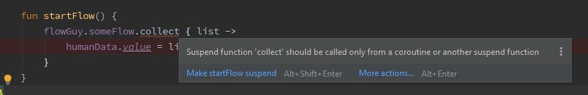

Flow is fun to play around with.

In short, it represents a cold stream of values. Kind of like my typical afternoon drinking a stream of too many cold ones.

Aside from looking at memes all day we might as well write some code.

<!-- https://gist.github.com/CostaFot/7fa0f80dce98300daf153ccec3212a40 -->

```kotlin
class FlowGuy {

    val humans = mutableListOf<Human>()

    val someFlow : Flow<List<Human>> = flow {
        for (i in 1..10000) {
            delay(1000) // pretending to do something that will take a while here
            humans.add(0, Human(i))
            emit(humans)
        }
    }.flowOn(Dispatchers.IO)
}
```

*FlowGuy.kt*

`FlowGuy` holds this stream that will emit a new list containing humans every 1 second.

All this work will happen on the `IO` thread/scheduler/whatever, just to be safe and keep the `UI` thread free.

Since this is a cold stream, nothing is actually happening when we run our app until someone starts collecting this `someFlow` variable.

#### Am I flowing yet?

<!-- https://gist.github.com/CostaFot/ad97e9d1315fb3859d44ea953f4c5beb -->

```kotlin
class ViewModelDude @Inject constructor(
    private val flowGuy: FlowGuy
) : ViewModel() {

    val humanData = MutableLiveData<List<Human>>()

    fun startFlow() {
        flowGuy.someFlow.collect { list ->
            humanData.value = list
        }
    }
}
```

*ViewModelDude*

This seems fairly standard but the editor will complain:



This flow could take a while and it would be awful to have a memory leak. Let’s use the classic `viewModelScope` then.

<!-- https://gist.github.com/CostaFot/53a1cb147a0a73fe1574374aff0ebe96 -->

```kotlin
 fun startFlow() {
        viewModelScope.launch {
            flowGuy.someFlow.collect { list ->
                humanData.value = list
            }
        }
    }
```

*startFlow.kt*

> shameless plug to the best way of (un)learning coroutines:
> 
> [Kotlin Coroutines Review](/kotlin-coroutines-review/)


*shame 🔔🔔*

Since this flow is returning a list of humans, it would be nice to see the results of this happening in real-time with a nice adapter-recyclerview combo.

A fragment with a button and said recyclerview should do it.

<!-- https://gist.github.com/CostaFot/0747f06f7ae4a8e0465bf7e8dab74677 -->

```kotlin
    lateinit var humanAdapter: HumanAdapter

    override fun onViewCreated(view: View, savedInstanceState: Bundle?) {
        super.onViewCreated(view, savedInstanceState)

        humanAdapter = HumanAdapter(emptyList())
        recyclerview.layoutManager = LinearLayoutManager(view.context, RecyclerView.VERTICAL, false)
        recyclerview.adapter = humanAdapter

        viewModel.humanData.observe(viewLifecycleOwner) { humans ->
            humanAdapter.items = humans
            humanAdapter.notifyDataSetChanged()
        }

        button.setOnClickListener {
            viewModel.startFlow()
        }
    }
```

*Fragment.kt*

-   Get an adapter-recycler ready then observe for changes in the livedata variable that the ViewModel holds.  
    Once a change has been observed we pass the whole thing into the adapter
-   A button will trigger the start of the flow.

#### Title here

Let’s try this out!


That’s it. You are free to go watch YouTube now.

#### Hol’ up!

There is something very fishy with this example.

A flow can take milliseconds to complete, or it can take minutes/hours as in the example above. Maybe it will never “really” complete.

[Room](https://medium.com/androiddevelopers/room-flow-273acffe5b57), for instance, provides observable reads with [`Flow`](https://kotlin.github.io/kotlinx.coroutines/kotlinx-coroutines-core/kotlinx.coroutines.flow/-flow/) enabling you to get notified of changes in your database.

Launching a collection from the click of a button, or any 1-shot operation that can be repeated, suddenly doesn’t sound like a great idea.

Case in point when clicking the `START` button many times.


Running a `collect` multiple times will **not** stop the previous collections that are in progress.

#### What now?

Returning to the original issue- it is fixed easily by keeping a reference to the coroutine/Job and cancelling it before running a collection.

<!-- https://gist.github.com/CostaFot/e542b7716072b8f0d1b2cfa7846f62bc -->

```kotlin
class ViewModelDude @Inject constructor(
    private val flowGuy: FlowGuy
) : ViewModel() {

    val humanData = MutableLiveData<List<Human>>()
    var collection: Job? = null

    fun startFlow() {
        collection?.cancel()
        collection = viewModelScope.launch {
            flowGuy.someFlow.collect { list ->
                humanData.value = list
            }
        }
    }
}
```

*ViewModelDude.kt*

In the event you are interested in only collecting a few values from a stream then there’s a handy operator for that- `take(number)` .

<!-- https://gist.github.com/CostaFot/7622cccad39789fb3cd45c50294572a5 -->

```kotlin
 fun startFlow() {
        collection?.cancel()
        collection = viewModelScope.launch {
            // we only want 4 updates, stop the flow after that
            flowGuy.someFlow.take(4).collect { list ->
                humanData.value = list
            }
        }
    }
```

*startFlow.kt*

---


Source code can be found [here](https://github.com/CostaFot/overflow).

Later.
