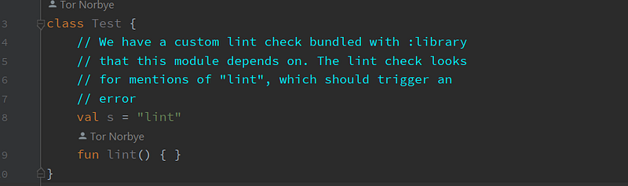
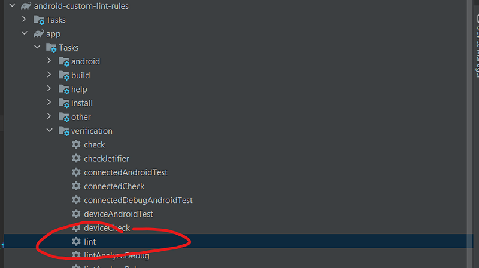
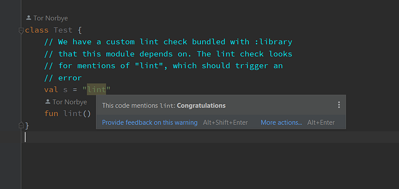
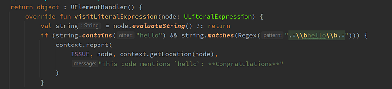
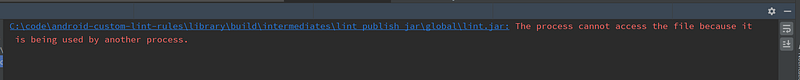
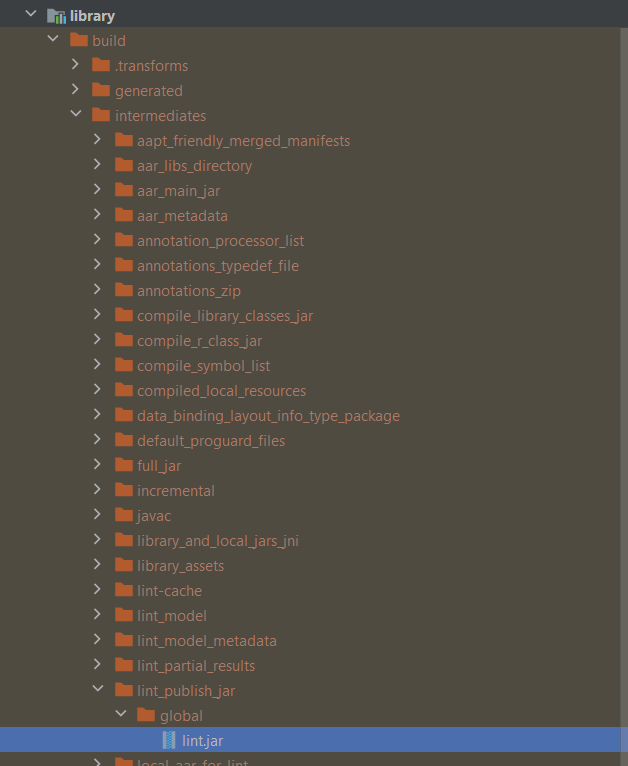
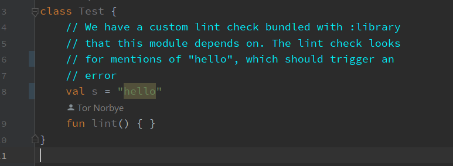

---

Was trying to create a silly custom lint rule the other day.

Of course, I played around with [https://github.com/googlesamples/android-custom-lint-rules](https://github.com/googlesamples/android-custom-lint-rules) (_monkey-see-monkey-do_).

I was under the impression that for editor highlighting to start working, I only had to build the app. (oh boy)

When I _did_ manage to make it show up, I had issues editing, deleting or even adding more rules.

So, without further ado..

#### It’s not enough just writing a custom lint rule

Rule [here](https://github.com/googlesamples/android-custom-lint-rules/blob/main/checks/src/main/java/com/example/lint/checks/SampleCodeDetector.kt).

As evidenced, no highlighting:

Run the lint check in Android Studio:

Voila!

#### Editing rules

Alter this rule to check for `hello` .

*[SampleCodeDetector](https://github.com/googlesamples/android-custom-lint-rules/blob/main/checks/src/main/java/com/example/lint/checks/SampleCodeDetector.kt)*

The string literal that contains the word `lint` is still highlighted even after building because we need to…

#### Run lint again

This pops up 🫠:

Let’s have a look what is this even and why would it complain:

#### ..okay?

I am not a smart man but I am going to assume something like this happens:

-   `lint` command does stuff on first run.
-   At the end, this `lint.jar` file is placed into the `build` folder.
-   Once in there, this file is actively “watched” by Android Studio/some java process. That’s how we get highlighting in editor.
-   Trying to replace the `lint.jar` by re-running `lint` will meet resistance. It’s busy being actively used.

#### Exit Android Studio

Open the `build` folder in explorer and delete all files in it.

Now re-open AS. The highlighting should be gone.

Run `lint` again.

`hello` is highlighted:

---

#### Considerations

Few things that are nagging me after messing with this for about an hour:

-   Should this `lint.jar` file be included in a project’s repository? (I couldn’t find any way to make this work outside the `build` folder)
-   Do we have to do the delete/replace dance everytime there is a change? (how many times is a lint rule going to change anyway 😅)
-   Hook `lint` in the normal build task via gradle? (not a good idea)

But also positives:

-   Everyone can see the rules in the project. Easily accessible.
-   Anything CI related.

#### Bundling lint rules in a separate library

[Timber](https://github.com/JakeWharton/timber/tree/trunk/timber-lint/src/main/java/timber/lint) is a classic example of shipping lint rules with a library.

-   The rules are built and packaged in the library as part of the publishing process. (you can explore inside the timber [aar file](https://repo1.maven.org/maven2/com/jakewharton/timber/timber/5.0.1/) and have a look)
-   The consumers don’t have to take any action just to see highlighting in the editor.

But!

-   Flexibility is lost due to using an external library that is not in the main project.

---

#### Anyways

Hope you found this somewhat useful.

All credit goes to [https://github.com/googlesamples/android-custom-lint-rules](https://github.com/googlesamples/android-custom-lint-rules).
