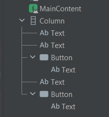
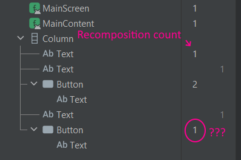
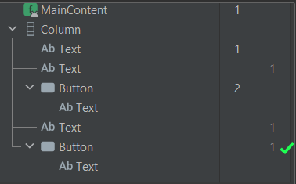
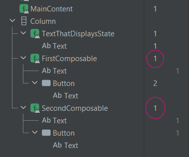
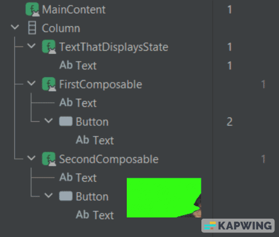
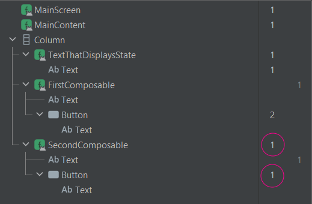
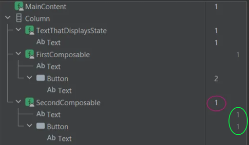

Compose is fun. I do get the feeling that there are quite a few “gotchas” when working with it, though.

Here are a few questions that kept bugging me:

-   Are all functions equal in the eyes of the compiler?
-   Are **suspend** functions stable/immutable?
-   Do recomposition scopes even matter much?

#### Housekeeping

The goal of this post is to understand how recomposition works, with a short real world example, the same way one does when starting to work on a new feature. Breaking stuff is way more fun than reading docs.

Let’s lose some brain cells together, shall we?

#### The setup

Here’s a typical “root” composable.

```kotlin
@Composable
fun MainScreen(
    viewModel: MainViewModel = hiltViewModel(),
) {
    val state: String by viewModel.state.collectAsStateWithLifecycle()
    MainContent(
        state = state,
        onUpdateState = { viewModel.updateState() },
        onDoSomethingElse = { viewModel.doSomethingElse() },
    )
}
```

*MainScreen.kt*

The job of `viewmodel.updateState()` is to generate a new, random `state` string. This will essentially trigger recomposition on the root composable.

But what about its children?


#### First pass

Throw everything in one composable just to get something on the screen.

```kotlin
@Composable
fun MainContent(
    state: String,
    onUpdateState: () -> Unit,
    onDoSomethingElse: () -> Unit
) {
    Column {
        Text(text = state)
        Text(text = "hello first")
        Button(
            onClick = {
                onUpdateState()
            }
        ) {
            Text(text = "Click me to update state")
        }
        Text(text = "hello second")
        Button(
            onClick = {
                onDoSomethingElse()
            }
        ) {
            Text(text = "Click me to do something else")
        }
    }
}
```

*MainContent.kt*

This is a bit sloppy, but hey, it works.

[Layout Inspector](https://developer.android.com/jetpack/compose/tooling/layout-inspector#recomposition-counts) is pretty useful here to figure out what is going on. It shows when composables in a layout hierarchy have either recomposed or skipped.

The layout hierarchy at the moment looks like this:



Upon clicking the first `Button`, `state` will be updated and trigger recomposition on `MainContent`.

Now, let’s stop and think. Which composables are expected to be recomposed?

The first `Text` is using the `state`. Should definitely recompose.

The first `Button` should also recompose. Twice in fact. Once on press, and once on release.

#### The reality?



*Numbers on the left column represent recomposition count, on the right is the skipped count.*

This is strange. All composables that have nothing to with `state` should always skip recomposition.

Why is the second, completely unrelated, `Button` recomposing then?

#### Lambda shmambda

In compose world, some functions are more equal than others. 🫠

Method references seem to work better than lambdas. Let’s try that.

```kotlin
@Composable
fun MainScreen(
    viewModel: MainViewModel = hiltViewModel(),
) {
    val state: String by viewModel.state.collectAsStateWithLifecycle()
    MainContent(
        state = state,
        onUpdateState = viewModel::updateState,
        onDoSomethingElse = viewModel::doSomethingElse,
    )
}
```

*MainScreen.kt*

Hey, the second button is skipping recomposition now.



#### Enhance 🔍

This is good enough for a start. There is one issue, though.

Since everything is thrown inside one big composable, every **direct** child is being evaluated for recomposition.

This is due to `Column` being an _inline_ composable (same for other container-types e.g `Box`). It does not have a recomposition scope.

This can also be observed in the layout inspector. `Column` does **not** have its own recomposition/skip counters.

Time to stop being sloppy and create more composables.

#### Second pass

This whole layout can be split into 3 different parts.

```kotlin
@Composable
fun MainContent(
    state: String,
    onUpdateState: () -> Unit,
    onDoSomethingElse: () -> Unit
) {
    Column {
        TextThatDisplaysState(state = state)
        FirstComposable(onUpdateState = onUpdateState)
        SecondComposable(onDoSomethingElse = onDoSomethingElse)
    }
}
```

*MainContent.kt*

The children that represent each part:

```kotlin
@Composable
fun TextThatDisplaysState(state: String) {
    Text(text = state)
}

@Composable
private fun FirstComposable(onUpdateState: () -> Unit) {
    Text(text = "hello first")
    Button(
        onClick = {
            onUpdateState()
        }
    ) {
        Text(text = "Click me to update state")
    }
}

@Composable
private fun SecondComposable(onDoSomethingElse: () -> Unit) {
    Text(text = "hello second")
    Button(
        onClick = {
            onDoSomethingElse()
        }
    ) {
        Text(text = "Click me to do something else")
    }
}
```

*Children.kt*

All the newly created custom composables now have their own recomposition scope. If the inputs have not changed, recomposition should be skipped.

Layout inspector begs to differ.



*wat*

Ok, `FirstComposable` and `SecondComposable` inputs have not changed. Why were they recomposed?!

Since this does not make much sense, let’s dig deeper with [compiler metrics](https://github.com/androidx/androidx/blob/androidx-main/compose/compiler/design/compiler-metrics.md).

#### Compiler metrics

If you haven’t already, I would strongly suggest reading through the excellent [Composable metrics](https://chris.banes.me/posts/composable-metrics/) article by Chris Banes.

**TLDR:** The compose compiler can export metrics on how “performant” composables are.

In layman’s terms — depending on the composable parameters, the compiler would know in advance to avoid recomposition if the inputs have not changed.

What would be ideal? The compiler really likes composables declared as `restartable skippable` in the `...-composables.txt` file.

#### Let’s try it

After running the metrics on the **release** build, the composables can be found in the output.

```text
restartable skippable scheme("[androidx.compose.ui.UiComposable]") fun TextThatDisplaysState(
  stable state: String
)
restartable skippable scheme("[androidx.compose.ui.UiComposable]") fun FirstComposable(
  stable onUpdateState: Function0<Unit>
)
restartable skippable scheme("[androidx.compose.ui.UiComposable]") fun SecondComposable(
  stable onDoSomethingElse: Function0<Unit>
)
```

*metrics.txt*

All composables are `restartable skippable`.

Is the layout inspector right? Is the compiler report wrong?

Are we just seeing weird things due to using the layout inspector on the `debug` variant, which is not running fully optimized compose code?

Thus, I am invoking Cunningham’s Law by posting the wrong answer here in an attempt to get corrected in the comments.


#### We have to go deeper

Alright, there’s one more thing to try.

This [excellent article by Justin Breitfeller](https://multithreaded.stitchfix.com/blog/2022/08/05/jetpack-compose-recomposition/) suggests using _remembered lambdas._

(maybe I should be at the pub instead of spelling out the phrase “remembered lambdas” on a Friday night but w/e it’s too late now)

```kotlin
@Composable
fun MainScreen(
    viewModel: MainViewModel = hiltViewModel(),
) {
    val onUpdateState: () -> Unit = remember(viewModel) {
        return@remember viewModel::updateState
    }

    val onDoSomethingElse: () -> Unit = remember(viewModel) {
        return@remember viewModel::doSomethingElse
    }
    val state: String by viewModel.state.collectAsStateWithLifecycle()
    MainContent(
        state = state,
        onUpdateState = onUpdateState,
        onDoSomethingElse = onDoSomethingElse,
    )
}
```

*MainScreen.kt*

Checking the layout inspector one final time, nothing should be recomposed apart from `TextThatDisplaysState` and the `Button` that is clicked.

Ideally, some composables **should not even be evaluated** for recomposition, as their parent composable is skipped altogether.



Hey, it worked!

#### Suspend functions as composable parameters

Does the compose compiler even _like_ suspend functions?

```kotlin
@Composable
private fun SecondComposable(onDoSomethingElse: suspend () -> Unit) {
    val scope = rememberCoroutineScope()
    Text(text = "hello second")
    Button(
        onClick = {
            scope.launch {
                onDoSomethingElse()
            }
        }
    ) {
        Text(text = "Click me to do something else")
    }
}
```

*SecondComposable.kt*

Remember: the `SecondComposable` is never interacted with, and it has nothing to do with `state`. Only the `Button` inside `FirstComposable` is clicked.



It seems that suspend functions are not ideal parameters for composables. `SecondComposable` and its child `Button` are being recomposed for no reason.

I _think_ this makes sense? Suspend functions are [quite complicated](https://medium.com/androiddevelopers/the-suspend-modifier-under-the-hood-b7ce46af624f) under the hood.

The compiler metrics confirm this too, by marking this composable as `restartable` only, not `skippable`.

```text
restartable scheme("[androidx.compose.ui.UiComposable]") fun SecondComposable(
  unstable onDoSomethingElse: SuspendFunction0<Unit>
)
```

*metrics.txt*

Even if the suspend function is only used inside a `LaunchedEffect`, or just passed downstream, recomposition will not be skipped.

Children that have nothing to do with the suspend function will be skipped appropriately though, so it’s not all that bad, really.

```kotlin
@Composable
private fun SecondComposable(onDoSomethingElse: suspend () -> Unit) {
    LaunchedEffect(Unit) {
        onDoSomethingElse()
    }
    Text(text = "hello second")
    Button(
        onClick = {}
    ) {
        Text(text = "Click me to do something else")
    }
}
```

*SecondComposable.kt*



#### Addendum

If you made it this far, you might be thinking: is all this even worth it?


The docs and various blogs on the internet are against premature optimization.

On the one hand, going for “perfect” composables is an exercise in futility — especially on a large codebase with features out the door on a frequent basis. The code itself gets quite hard to read too, while the benefits are debatable.

On the other hand, it’s quite fun aiming for well-behaved compose code. Plus, it’s beneficial to the actual end-user, especially on low-end devices. I am currently on this camp.

One could say that if using a framework leads to this type of discussions, further improvements might be warranted.

#### So, what do?

If you run into performance issues, going through the problematic areas with the layout inspector can immediately point to where excessive recompositions are happening.

That said, compiler metrics are (imho) superior to layout inspector as they require zero manual testing on a device.

The main issue with compiler metrics is running the gradle command on a release build, with `--rerun-tasks`, to ensure that the Compose Compiler runs, even when cached.

This can really take a while if you are on a not-so-blazing fast machine, which defeats the fast iteration/feedback loop.

#### Anyways

Hope you found this somewhat useful.

[@markasduplicate](https://twitter.com/markasduplicate)

Later.
