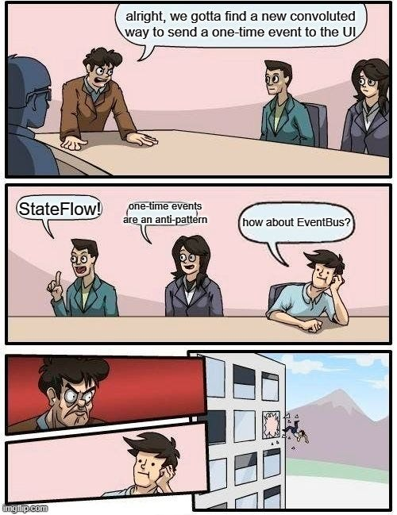
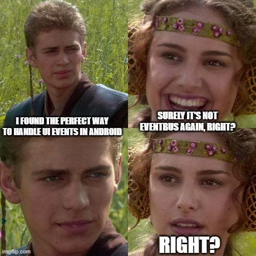

Sometimes, I get the impression one needs 42 hours of research and a PhD dissertation to figure out how to send a one-time event from the ViewModel layer to the UI safely these days.

Memes aside, it feels like there is no “true” consensus on how to do such a simple thing in 2 lines.

Each approach has:

-   gotchas
-   questionable antipatterns
-   a lot of boilerplate

...or plainly does not work in edge cases.

Why not add to the confusion with another take, then?

#### TL;DR

```kotlin
// viewModel layer
class MyViewModel: ViewModel() {
  private val _eventWithChannel = Channel<Event>()
  val eventFlowFromChannel = _eventWithChannel.receiveAsFlow()
}

 sealed class Event {
    object NavigateToAnotherScreen: Event()
 }

// compose layer
LaunchedEffect(lifecycleOwner) {
        lifecycleOwner.repeatOnLifecycle(Lifecycle.State.STARTED) {
            // switch to Dispatchers.Main.immediate maaaaaaaybe a bit overkill
            withContext(Dispatchers.Main.immediate) {
                viewModel.eventFlowFromChannel.collect {
                   // handle one-time event
                }
            }
        }
    }
```

*channel\_flow\_immediate\_v1.kt*

#### Houston, we have a problem

[Google](https://developer.android.com/topic/architecture/ui-layer/events#handle-viewmodel-events) guides, as well as [ViewModel: One-off event antipatterns](https://medium.com/androiddevelopers/viewmodel-one-off-event-antipatterns-16a1da869b95), are actually opinionated on this subject.

Long story short, one-time events should be part of the all-encompassing UI state inside the ViewModel, handled accordingly in the UI layer. Separating events to their own stream is naughty.

I don’t necessarily disagree with them, to be honest. But I do think it is a bit overboard for 99.8% of cases out there.

It also introduces manual steps to handle/reset the state at the right time, thus resulting in a potential failure point that would not exist otherwise.

Sometimes, you just need a bit of a caveman approach that just works and is unit-testable. Should it _really_ be this complicated? 😰



#### Option 1 — StateFlow/Compose State

They are not intended to be used for one-time events out of the box, as they are observable **state** holders.

A good example is sending an event to navigate to another screen, while the current screen stays in the back stack.

Pressing back, the last event will be read again, resulting in an awkward loop of going forward to the other screen again!

This _can_ be avoided with more work, as described by the Google guide. If that is interesting to you, more details can be found [here](https://developer.android.com/topic/architecture/ui-layer/events#handle-viewmodel-events).

#### Option 2 — SharedFlow — He’s dead, Jim

```kotlin
// viewModel layer
class MyViewModel: ViewModel() {
    private val _eventWithSharedFlow = MutableSharedFlow<Event>()
    val eventWithSharedFlow: SharedFlow<Event> = _eventWithSharedFlow
}

// compose layer
LaunchedEffect(lifecycleOwner) {
        lifecycleOwner.repeatOnLifecycle(Lifecycle.State.STARTED) {
            viewModel.eventWithSharedFlow.collect {
              // handle one-time event
            }
        }
}
```

*sharedflow\_event.kt*

`SharedFlow` seems to be the perfect candidate for a stream of one-time events. Meaning:

-   An event is emitted to the flow.
-   The collector in the compose layer receives it and does something with it.
-   Once consumed, the event won’t be seen again, for example when rotating the screen.

Sounds perfect? Not really.

Flow collection in the UI layer should be performed only while the lifecycle is above the `STARTED` state, to avoid wasting resources. (see more [here](https://medium.com/androiddevelopers/a-safer-way-to-collect-flows-from-android-uis-23080b1f8bda))

A good example of this is the [`collectAsStateWithLifecycle`](https://developer.android.com/reference/kotlin/androidx/lifecycle/compose/package-summary#%28kotlinx.coroutines.flow.StateFlow%29.collectAsStateWithLifecycle%28androidx.lifecycle.Lifecycle,androidx.lifecycle.Lifecycle.State,kotlin.coroutines.CoroutineContext%29) / [`repeatOnLifecycle`](https://developer.android.com/topic/libraries/architecture/coroutines#restart) extension functions.

Imagine an event emitted to the `SharedFlow` to navigate to another screen, while the UI is in the `PAUSED` state. The result?

-   The collector will not be there to receive it.
-   The event is lost forever.
-   The user was never redirected to the next screen. We now have an inappropriate state and a 1-star review.

#### Option 3— StateFlow + SingleLiveEvent — It’s alright, I guess?

One-time events have been a hot topic since the days of `LiveData`. This class probably exists in 95% of apps out there.

```kotlin
data class SingleLiveEvent<out T>(private val content: T) {

    var hasBeenHandled = false
        private set // Allow external read but not write

    /**
     * Returns the content and prevents its use again.
     */
    fun getContentIfNotHandled(): T? {
        return if (hasBeenHandled) {
            null
        } else {
            hasBeenHandled = true
            content
        }
    }
}
```

*data\_SingleLiveEvent.kt*

`LiveData` is deprecated™, so let’s try using it with `StateFlow`.

```kotlin
class MyViewModel: ViewModel() {
    private val _stateflowSingleLiveEvent = MutableStateFlow<SingleLiveEvent<Event>?>(null)
    val stateflowSingleLiveEvent: StateFlow<SingleLiveEvent<Event>?> = _stateflowSingleLiveEvent
}

// compose layer
LaunchedEffect(lifecycleOwner) {
    lifecycleOwner.repeatOnLifecycle(Lifecycle.State.STARTED) {
        viewModel.stateflowSingleLiveEvent.collect { singleLiveEvent ->
            singleLiveEvent?.getContentIfNotHandled()?.let { event ->
                when (event) {
                    // handle one-time event
                }
            }
        }
    }
}
```

*stateflow\_singleliveevent.kt*

This initially works, even if it looks a bit meh.

One would expect to see the same event repeatedly, on rotation for example, due to the nature of `StateFlow`, but the `getContentIfNotHandled` function guards against this.

There is one issue with it though.

Internally, `StateFlow` always checks for equality between the last and the new value when it gets updated. If both are the same, the new value will not be emitted to the collector.

Thus, **`data class SingleLiveEvent`** cannot be used as is, which is a shame as data classes are very convenient when unit testing.

It has to be converted to a regular `class` :

```kotlin
class SingleLiveEvent<out T>(private val content: T) {
       // same as before..
}
```

*SingleLiveEvent.kt*

#### Why is that?

Imagine a scenario where you need to send the same event twice in a row.

‼️ This is not so uncommon‼️

A lot of the times, a user would try something again and again, resulting in exactly the same error. (a toast, for example)

-   Update the flow for the first time. This should work fine.
-   Update the flow for a second time, with exactly the same event.
-   `StateFlow` compares old and new values internally.
-   Sees them as exactly the same. (it’s a **data** class, it does not check for reference equality, but what is inside them)
-   As they are the same, emission will be skipped.
-   Second event is lost.

#### But…

There is a workaround to this. A unique timestamp/ID can be added to every event.

```kotlin
data class SingleLiveEvent<out T>(
  private val content: T, 
  private val id: String = UUID.randomUUID().toString()
) {
     // same as before
}
```

*unique\_SingleLiveEvent.kt*

Not amazing, but hey, it works.

#### Option 4— Channel + Flow

As mentioned in the `TL;DR`, but not including `Dispatchers.Main.immediate` this time:

```kotlin
// viewModel layer
class MyViewModel: ViewModel() {
  private val _eventWithChannel = Channel<Event>()
  val eventFlowFromChannel = _eventWithChannel.receiveAsFlow()
}

// compose layer
LaunchedEffect(lifecycleOwner) {
        lifecycleOwner.repeatOnLifecycle(Lifecycle.State.STARTED) {
            viewModel.eventFlowFromChannel.collect {
              // handle one-time event
            }
        }
}
```

*channel\_flow.kt*

What are the advantages of this approach?

-   It works even if the collector is not there when the event is emitted. The event will be kept in the flow, until the collector comes back to the `STARTED` state to consume it.
-   Plain `Flow`, no need to bring in `LiveData` dependency.
-   Minimal boilerplate.
-   Easy to unit test and reason about.
-   No extra logic needed.

But also some disadvantages:

-   Does not work with multiple concurrent collectors.
-   There **is** the tiny possibility of missing an event.

The latter is due to the slight differences of `Dispatchers.Main` and `Dispatchers.Main.immediate`. Astute observers might also notice that `viewModelScope` is actually using [`immediate`](https://developer.android.com/reference/androidx/lifecycle/ViewModel#%28androidx.lifecycle.ViewModel%29.getViewModelScope%28%29) too.

Emitting hundreds of events in a _very_ short amount of time while constantly rotating the app can replicate this issue.

If you _really_ want to handle even the biggest of edge cases, then the flow has to be collected on `Dispatchers.Main.immediate`.

```kotlin
// viewModel layer
class MyViewModel: ViewModel() {
  private val _eventWithChannel = Channel<Event>()
  val eventFlowFromChannel = _eventWithChannel.receiveAsFlow()
}
// compose layer
LaunchedEffect(lifecycleOwner) {
        lifecycleOwner.repeatOnLifecycle(Lifecycle.State.STARTED) {
            withContext(Dispatchers.Main.immediate) {
                viewModel.eventFlowFromChannel.collect {
                   // handle one-time event
                }
            }
        }
    }
```

*channel\_flow\_immediate.kt*

#### Option 4 — [EventBus](https://github.com/greenrobot/EventBus)



*last EventBus joke, I swear*

#### Anyways

This list is not exhaustive by any means. There are about 15 different ways to do this type of stuff, but they are probably out of scope of a short little blog post.

Hope you found this somewhat useful.

[@markasduplicate](https://twitter.com/markasduplicate)

Later.
