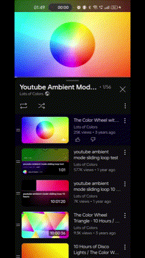
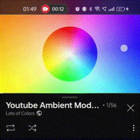
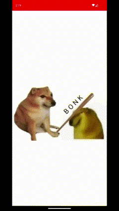
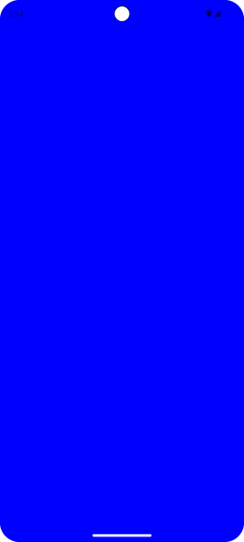
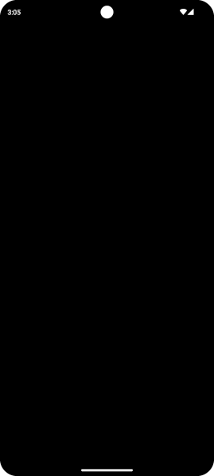
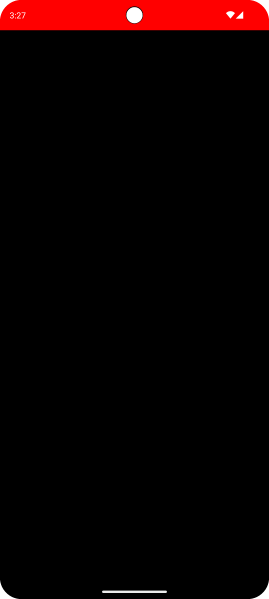
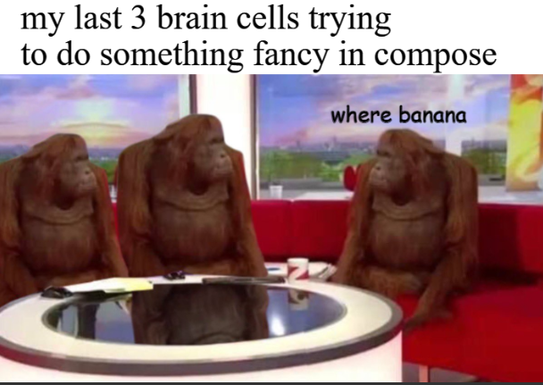

_Featured in_ [_Android Weekly Issue #614_](https://androidweekly.net/issues/issue-614)

---

Watching YouTube, one might notice a nice lighting effect going on around the edges of a video.



This is [Ambient Mode](https://support.google.com/youtube/answer/12827017?hl=en&co=GENIE.Platform%3DAndroid). It’s a lighting effect that surrounds a YouTube video with a soft, glowing light that usually reflects the colors featured in the video itself.

The effect seems to be taking advantage of the **whole** screen. This includes the space right where the clock, notifications and other system related functionalities reside.

In other words, the **system status bar**.

While the video player component can be dragged down to a mini-player, the lighting effect itself stays where it is. It slowly loses its alpha, until it is not visible at all anymore when the video player is fully minimized.

Quite nice eh?



---

#### Housekeeping

The goal of this post is to figure out how to use [Window Insets](https://developer.android.com/jetpack/compose/layouts/insets#inset-fundamentals) and display content [edge-to-edge in Compose](https://developer.android.com/jetpack/compose/layouts/insets).

Imitation is the sincerest form of flattery, so let’s try to copy what YouTube does in 5 minutes — badly. 💀

#### TL;DR



Besides a stale meme, what do we have here?

-   Edge-to-edge effect  
    \- Background is **fully** covered by the app, system bars included
-   A space behind the system status bar where color/alpha can be manipulated  
    \- Bright red when the doggo is fully expanded, faint red when contracted
-   Control of the status bar icon tint  
    \- Light, in this case, to contrast the dark background
-   A resizable box (bonk included), playing the role of the video player

#### Setting up the theme

A normal theme will do.

```xml
<style name="AppTheme" parent="Theme.Material3.Light.NoActionBar">
    <item name="colorPrimary">@color/md_theme_light_primary</item>
    // ....
</style>
```

*theme.xml*

To avoid confusion, anything handling system bars in the XML theme is a no-no.

```xml
// don't do this :( 
<item name="android:statusBarColor">....</item>
<item name="android:navigationBarColor">.....</item>
<item name="android:windowLightStatusBar">....</item>
<item name="android:windowLightNavigationBar">.....</item>
//....
```

*nono.xml*

#### Sidenote on theming

All compose theming below uses **hard-coded** colors for brevity.

Theming with respect to light/dark/dynamic color schemes should ideally be implemented depending on your needs.

#### Enable edge-to-edge

Since we want our app to display content behind the system UI and cover the whole screen, it would be nice to make the system bars completely transparent.

This can be accomplished with [enableEdgeToEdge()](https://developer.android.com/reference/androidx/activity/ComponentActivity#%28androidx.activity.ComponentActivity%29.enableEdgeToEdge%28androidx.activity.SystemBarStyle,androidx.activity.SystemBarStyle%29):

```kotlin
AppTheme {
        var systemBarStyle by remember {
            val defaultSystemBarColor = android.graphics.Color.TRANSPARENT
            mutableStateOf(
                SystemBarStyle.auto(
                    lightScrim = defaultSystemBarColor,
                    darkScrim = defaultSystemBarColor
                )
            )
        }
        LaunchedEffect(systemBarStyle) {
            enableEdgeToEdge(
                statusBarStyle = systemBarStyle,
                navigationBarStyle = systemBarStyle
            )
        }
    }
```

*MainActivity.kt*

[`SystemBarStyle.auto`](https://developer.android.com/reference/androidx/activity/SystemBarStyle#auto%28kotlin.Int,kotlin.Int,kotlin.Function1%29) handles the icon tint automatically. Meaning:

-   In light mode, icon tint will be **dark**  
    \- The system expects to have some sort of light color background behind the icons. That way they contrast nicely and are clearly visible
-   The opposite happens for dark mode — i.e. icon tint will be **light**

#### Time to test it

```kotlin
Surface(
  modifier = Modifier.fillMaxSize(),
  color = Color.Blue
) { }
```

*Surface.kt*



Light mode + `auto` = dark icons. They are barely discernible. 😰

Let’s fix that.

#### Scaffolding

Usually, the first thing someone adds at the top level is a `Scaffold`. Let’s make it black and draw on top this ugly blue color.

While we are at it, fix the status bar icon tint with a `LaunchedEffect`.

```kotlin
@Composable
private fun MainContent(
    changeSystemBarStyle: (SystemBarStyle) -> Unit // pass function from top level to change the SystemBarStyle
) {
    Scaffold(
        modifier = Modifier.fillMaxSize(),
        containerColor = Color.Black
    ) { paddingValues ->
        
        LaunchedEffect(Unit) {
            changeSystemBarStyle(SystemBarStyle.dark(android.graphics.Color.TRANSPARENT))
        }
        
    }
}
```

*MainContent.kt*

`SystemBarStyle.dark` is signalling to the system that we have a **dark** background occupying the status bar space.

To that end, **light** icon tint will be provided, for a nice contrast.



*hey, it works*

#### Handling insets manually

`Scaffold` provides `paddingValues` to help avoid the system bars. Normally, these paddings would be assigned as is, to the first child container.

Let’s use them, with a slight twist:

```kotlin
@Composable
fun MainContent() {
    Scaffold { paddingValues ->
        // ....
        val layoutDirection = LocalLayoutDirection.current
        Box(
            modifier = Modifier
                .fillMaxSize()
                .padding(
                    start = paddingValues.calculateStartPadding(layoutDirection),
                    end = paddingValues.calculateEndPadding(layoutDirection),
                    bottom = paddingValues.calculateBottomPadding(),
                )
        ) {
            Column(
                modifier = Modifier.fillMaxSize()
            ) {
                Spacer(
                    modifier = Modifier
                        .windowInsetsTopHeight(WindowInsets.statusBars)
                        .fillMaxWidth()
                        .background(Color.Red)
                )
            }
        }
    }
}
```

*MainContent.kt*

What is happening here?

-   We ensure that important content and interactions are not obscured by the system UI, with `paddingValues.calculateStartPadding`, and equivalents
-   Since we **do** want to draw behind the status bar, the top padding is omitted
-   Finally, a red-colored `Spacer` is positioned right where the status bar is, matching its exact height with `windowInsetsTopHeight(WindowInsets.statusBars)`



#### Bonus round — Implementing a resizable and draggable Box

Now that the system bars are taken care of, time for the poor man’s video player.

This is the part where someone can get really clever with some compose magic.

Gesture/scroll detection, advanced math and graceful recalculation of dimensions/colors, in order to save CPU cycles and the UI thread from being overloaded.

Unfortunately, I am way too stupid for that. A simple caveman solution based on [`detectVerticalGestures`](https://developer.android.com/jetpack/compose/touch-input/pointer-input/understand-gestures) will do.

```kotlin
@Composable
fun BoxWithConstraintsScope.draggableBox() {
    Box(
        modifier = Modifier
            .fillMaxWidth()
            .height(boxHeight)
            .background(Color.White)
            .align(Alignment.BottomCenter)
            .pointerInput(Unit) {
                detectVerticalDragGestures { change, dragAmount ->
                    if (dragAmount < 0f) {
                        // dragging up
                    } else if (dragAmount > 0f) {
                        // dragging down
                    }
                }
            }
    ) {
        Image( .... ) // doggo here
    }
}
```

*DraggableBox.kt*

The complete solution is way too long-winded for this little blog. You can find it [here](https://gist.github.com/CostaFot/1f3f6c1e8c74909c2a29bc56fda85deb) if you are curious.


All that’s left is actually implementing the YouTube UI.

One clap = one prayer 🙏, and I’ll get right on it on part 2. (lie)



---

#### Anyways

Hope you found this somewhat useful.

[@markasduplicate](https://twitter.com/markasduplicate)

Later.
