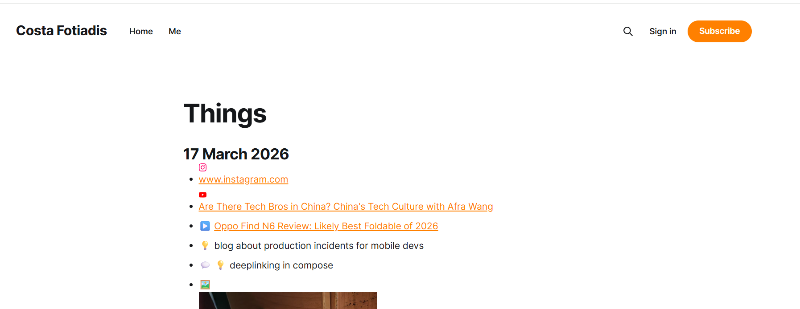

I've always wanted one of these pages. You know the type — "things I find interesting", "reading list" yada yada. Basically a dumping ground for interesting stuff I come across on the day-to-day.

So, I made a telegram bot that does it for me.

### TL;DR

> **[Things](https://www.costafotiadis.com/things-feed/)**
> Android dev, mostly. Kotlin, Compose, and whatever’s not yet deprecated this week.

### The setup

Two repos:

[**things-bot**](https://github.com/CostaFot/things-bot) — a ~170 line Python script running on Railway. It's a Telegram bot.

You send it a URL, it fetches the page title (or the YouTube video title via oEmbed), optionally generates a one-liner summary via the Claude API, formats a markdown entry, and commits it to the second repo.👇

[**things**](https://github.com/CostaFot/things) — just a markdown file. Rendering it directly on this website via `/html` block on the [things-feed page](https://www.costafotiadis.com/things-feed/).

The bot writes to this repo. [Railway](https://railway.com/) watches the other one.

**The workflow**: see something interesting → message Telegram bot → ✅. It goes to the markdown file within a few seconds.

### The stack

-   **python-telegram-bot** for the bot plumbing
-   **httpx** for async HTTP (fetching titles, hitting the GitHub API)
-   **GitHub Contents API** for reading and writing the markdown file directly — no git CLI, no cloning, just REST calls
-   [**Railway**](https://railway.com/) for hosting — free tier, deploy from GitHub, add env vars, forget about it

### Anyways

Hope you found this somewhat useful.

[@markasduplicate](https://x.com/markasduplicate)
