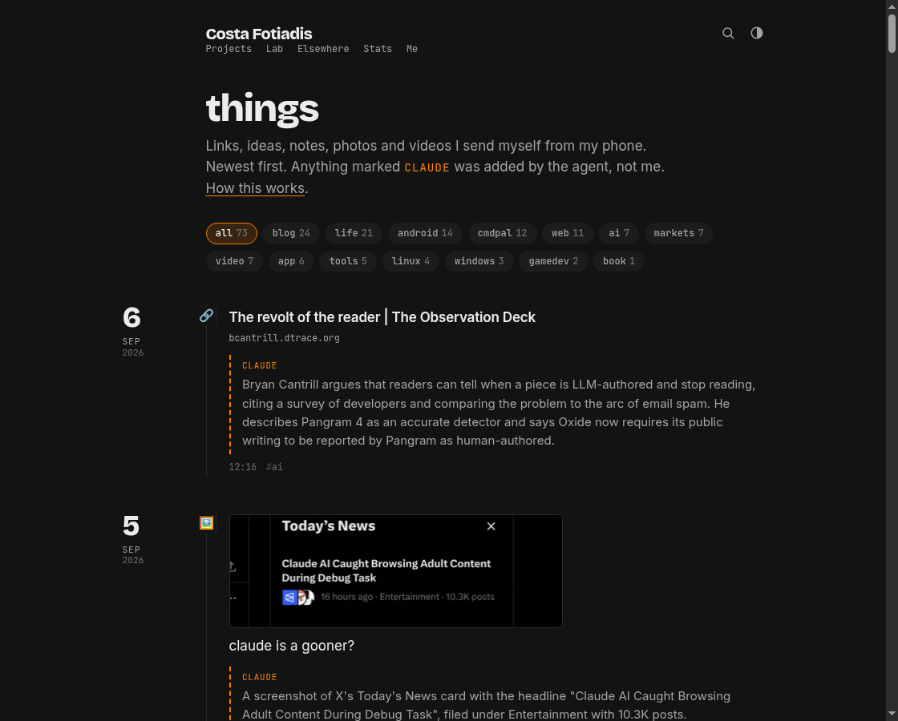

I’ve always wanted one of these pages. You know the type — “things I find interesting”, “reading list” yada yada. Basically a dumping ground for interesting stuff I come across on the day-to-day.

### TL;DR

> **[Things](/things/)**
> Links, ideas, notes, photos and videos I send myself from my phone.



### Where is this hosted?

This very blog you are reading is just a static Astro site in a git repo - aptly named https://github.com/CostaFot/costafotiadis.com. Which means the feed can just be… files in the repo. 

Now, there is the option of hosting these very files outside the repo in a separate service/DB/whatever, but why bother? 😊

```json
{
  "id": "20260906_091658",
  "date": "2026-09-06T12:16:58+03:00",
  "type": "link",
  "text": "",
  "url": "https://bcantrill.dtrace.org/2026/09/05/the-revolt-of-the-reader/",
  "title": "The revolt of the reader | The Observation Deck",
  "tags": ["ai"],
  "claude": {
    "summary": "Bryan Cantrill argues that readers can tell when a piece is LLM-authored and stop reading, ....",
    "model": "claude-fable-5-1"
  }
}
```

*20260906_091658.json*

One JSON per entry does the trick - `text` is what I actually typed. Everything under `claude` is what the AI slopbot added just for fun. Is that needed? No. But dammit i am paying for tokens already, might as well make use of them.

### How does it get there from my phone?

There's 2 ways. The Claude Code mobile app is one. Just make sure to start every session as a remote session via `/rc`. The other is actually SSHing into a machine that runs the session. Tailscale/bb app and 100 other ways exist.

So in the end I send `/things <url> some comment` from the phone to that particular session/project. Claude/agent has a skill set up already to accept that command and follow a few steps. Run a script, fix typos (my text messaging skills are horrible), pick 1–3 tags from a fixed list if any are suitable. Then it writes a small summary of the link, runs the schema check, commits then finally pushes. 

Since I got the repo connected to Railway, every push to `main` builds and deploys the site. About two minutes later I get the live link back from mr Claude and that is it.

Images get copied into the repo as it's not worth it hosting them anywhere. Videos are another story since having a git repo full of very high quality phone vids is a horrible idea, even by my standards. 🙃

So they get transcoded with `ffmpeg` and uploaded to a Railway volume. Did I mention I love Railway?


### Is this generally a good idea?

Depends! Treating Git as sort of a database is not a great idea. Every `/things` message is triggering a commit and a push -- a **full** rebuild of the site.

That's not very efficient. And if I have messed things up badly somewhere, I might even take down the whole website itself. But hey, this is a personal website after all.


There's also the matter of needing an always-on machine awake somewhere with Claude running. That can be rectified with a remote VPS on Hetzner or another provider. The problem is setting it up and accepting the headache of it being a public machine anyone can attempt to get access to. 

My own machine(s) at home have been running 24/7 for years with no problems now, and I am not important enough to be targeted on a residential IP I think. Who knows these days though? :)

### Anyways

Hope you found this somewhat useful.

[@markasduplicate](https://x.com/markasduplicate)

Later.
