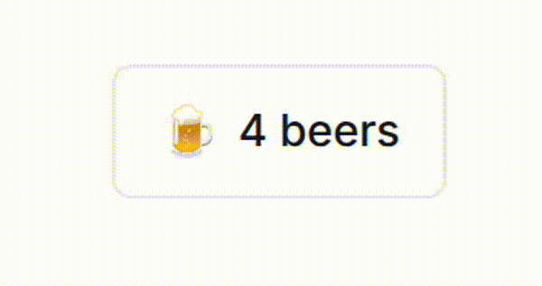

I needed some type of like/clap counter for my blog. But then again, likes are lame. What I _really_ needed was a **beer** 🍺 counter.

The problem is, I'm allergic to anything that resembles real backend work on a silly weekend project. So I used json file as a database, of course.

### TL;DR


### The backend

Our little [Flask app backend](https://github.com/CostaFot/claps-api/blob/main/app.py) exposes two endpoints — GET and POST `/claps` :

```python
@app.route("/claps", methods=["GET"])
def get_claps():
    data, _ = get_claps_file()
    key = normalise_url(request.args.get("url"))
    return jsonify({"claps": data.get(key, 0)})

@app.route("/claps", methods=["POST"])
def add_clap():
    data, sha = get_claps_file()
    key = normalise_url(request.args.get("url"))
    data[key] = data.get(key, 0) + 1
    save_claps_file(data, sha)
    return jsonify({"claps": data[key]})
```

*routes.py*

Each clap commits an updated [`claps.json`](https://github.com/CostaFot/claps/blob/main/claps.json) to the repo.

### Why this is a terrible idea, actually

GitHub's API (normally) has a rate limit of **5,000** requests per hour for authenticated requests. If you are lucky that is. Github lately has managed the impossible - even going lower than 90% uptime. Anyway where were we. Claps are greedy and spend that budget quite easily alright. But also, every page load does a `GET` to fetch the current count too. So we got 1 `GET` request per page load and 2 requests when a clap happens.

At an extremely generous 5% clap rate we've got roughly **~4,500 page loads per hour** before GitHub starts bouncing us. I don't know about you, but I am not getting these kinds of numbers just yet. 😊

There is also the slightly bigger problem of a race condition happening. Every `POST` does this little dance of _read_ → _increment_ → _write_. If you get 2 readers trying to buy me clap/beer at the same time (this does happen all the time of course), things can get ugly!

1.  Both would read the same count and the same `sha`
2.  Both would try to commit! GitHub will reject the second one with a 409 error (Conflict/SHA mismatch thing)
3.  So we got an unhandled exception/500. Dammit, the beer is lost now.

I guess there is actual value in spending the 15 minutes of setting up a real backend with a proper DB! Oh well.

### The frontend

The button is injected via Ghost's [`code injection`](https://ghost.org/tutorials/use-code-injection-in-ghost/). It hunts down the share bar and shoves itself right underneath. The count gets fetched on load.

On click it sends a `POST` and stores the clap in `localStorage`, so the same browser can't clap twice (no cheating!). Then a random first-clap message shows up.



There's also a silly easter-egg when clicking again. Try it out at the end of this post. 👇(shameless)

The text also fades in and out via a CSS transition so that it doesn't _just_ snap. That probably took me about 50 attempts to get right. I am not a web dev.

### Anyways

Hope you found this somewhat useful.

[@markasduplicate](https://x.com/markasduplicate?ref=costafotiadis.com)
