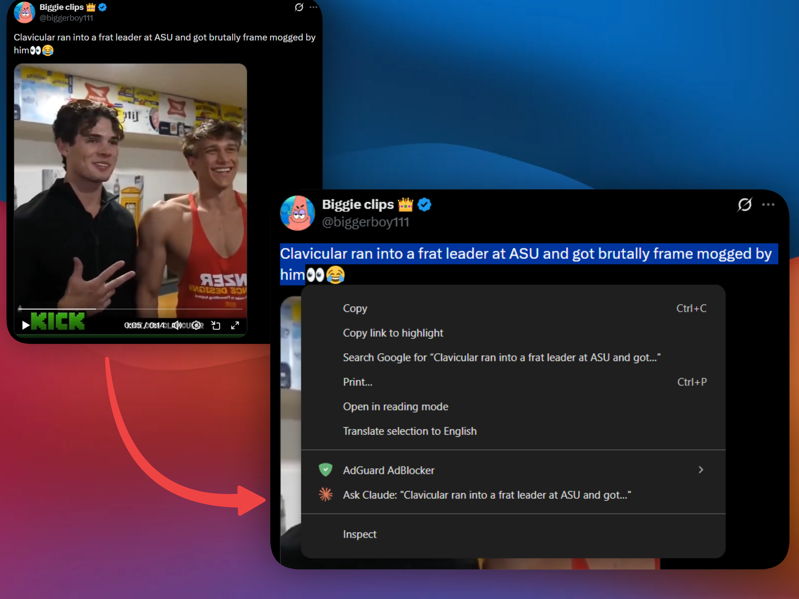
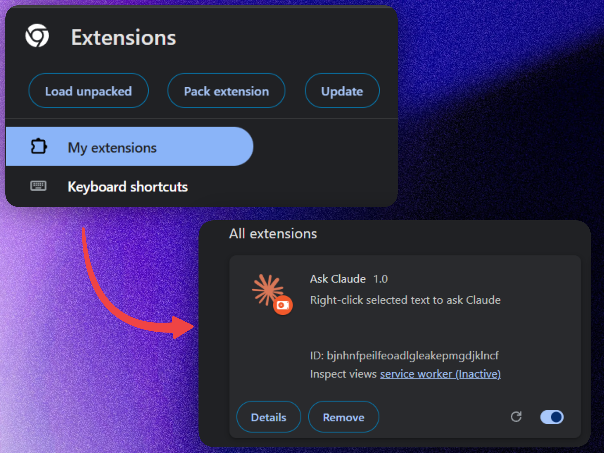

Scrolling the fever dream called Twitter, I came across this sentence:

> "Clavicular ran into a frat leader at ASU and got brutally frame mogged by him"

(frame mogged: physically dominated by someone with a superior physique, apparently)

None of those words are in the bible. I could have Googled it. Instead, I did what any reasonable person would do and built a Chrome extension.

---

### Housekeeping

Code is on [GitHub](https://github.com/CostaFot/ask-claude-extension) if you want to skip the post entirely.

> Download zip → `chrome://extensions` → Developer mode → Load unpacked → point to extracted folder
>
> **[Releases](https://github.com/CostaFot/ask-claude-extension/releases)**

_(slightly_ shortened snippets below for brevity)

### TL;DR

A Chrome extension that adds `Ask Claude` to the right-click menu. Select any text, right-click, and it opens Claude with enough context to _maybe_ give a useful answer.



### Three files

No build step, no npm install, no framework. Caveman. 🧌

```json
{
  "manifest_version": 3,
  "name": "Ask Claude",
  "version": "1.0",
  "description": "Right-click selected text to ask Claude",
  "permissions": ["contextMenus"],
  "background": {
    "service_worker": "background.js"
  },
  "content_scripts": [
    {
      "matches": ["https://claude.ai/*"],
      "js": ["content.js"]
    }
  ]
}
```

*manifest.json*

The context menu entry gets created on install. When it's clicked, it builds a prompt with the selected text and sends it to Claude.

```javascript
chrome.contextMenus.onClicked.addListener((info) => {
  if (info.menuItemId !== "askClaude") return;
  const text = `I selected "${info.selectionText}" on my browser\n\nI would normally Google this. Tell me what I need to know.`;
  chrome.tabs.create({ url: `https://claude.ai/new?q=${encodeURIComponent(text)}` });
});
```

*background.js*

The actual prompt ended up being:

> _I selected "X". I would normally Google this. Tell me what I need to know._

It's not much – but it's definitely better than sending "GitHub" and getting "What's up with GitHub? What are you trying to do?" — which is exactly what happened on my first few attempts. 😭

The last piece is a content script that auto-submits once the page loads, because clicking `Send` manually is way too much effort.

```javascript
const params = new URLSearchParams(window.location.search);
if (params.get("q")) {
  const trySend = setInterval(() => {
    const button = document.querySelector('button[aria-label="Send message"]');
    if (button && !button.disabled) {
      button.click();
      clearInterval(trySend);
    }
  }, 200);
  setTimeout(() => clearInterval(trySend), 5000);
}
```

*content.js*

The interval polling isn't pretty, but Claude's UI takes a moment to render the button — a simple `querySelector` on load would fire too early.

---

### Loading it

`chrome://extensions` → Developer mode → Load unpacked → point to root of project. Done.



### Anyways

Studies show that readers who don't click the 🍺 button below, are 73% more likely to get frame mogged at their local ASU frat party. Don't let this happen to you.

[@markasduplicate](https://x.com/markasduplicate?ref=costafotiadis.com)

Later
