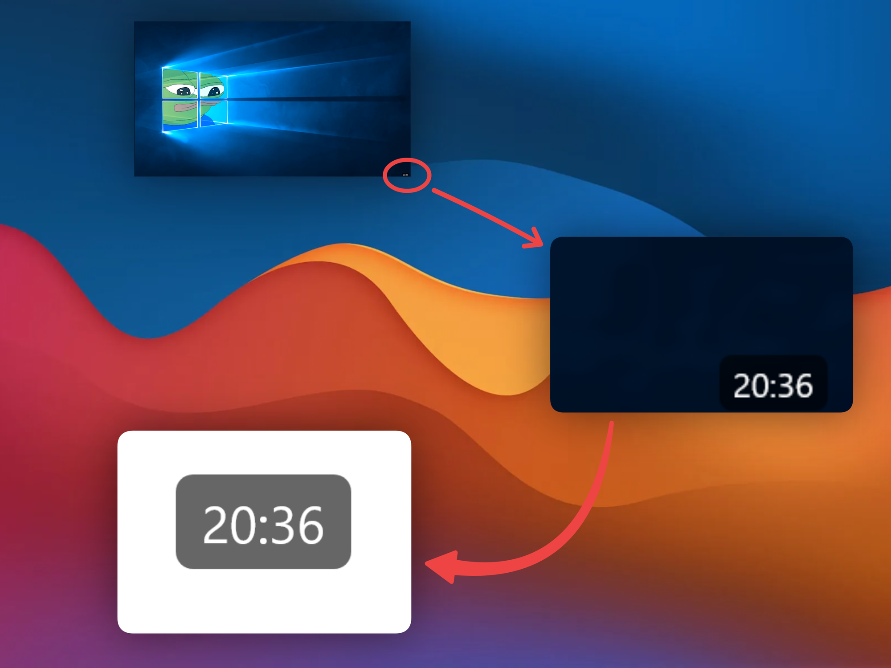
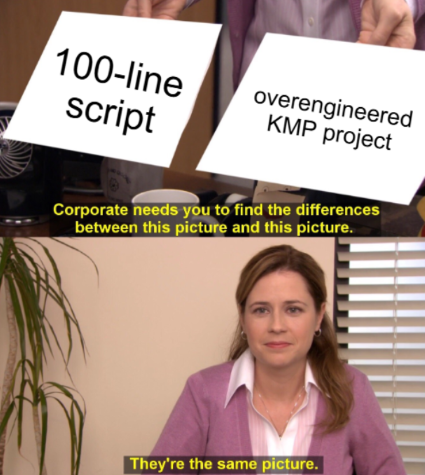
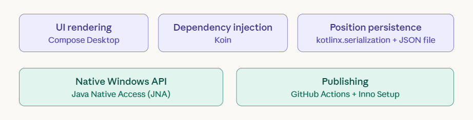
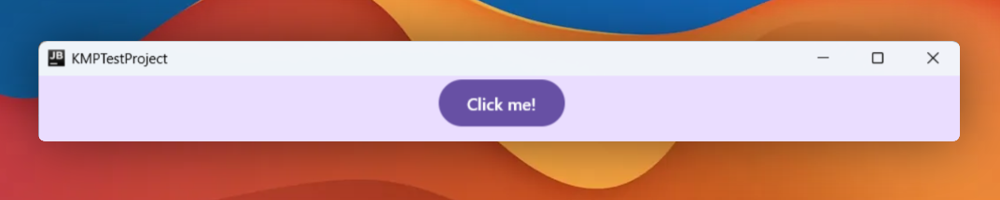
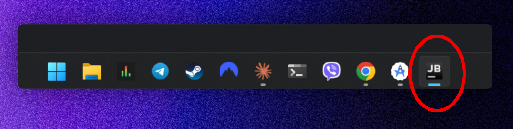
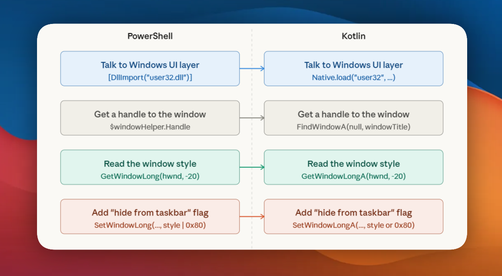
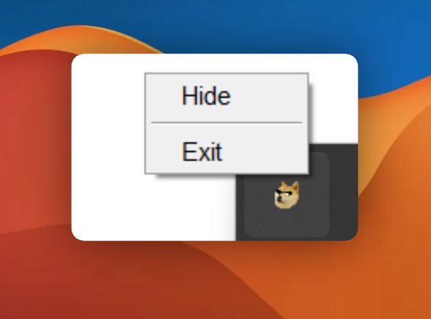
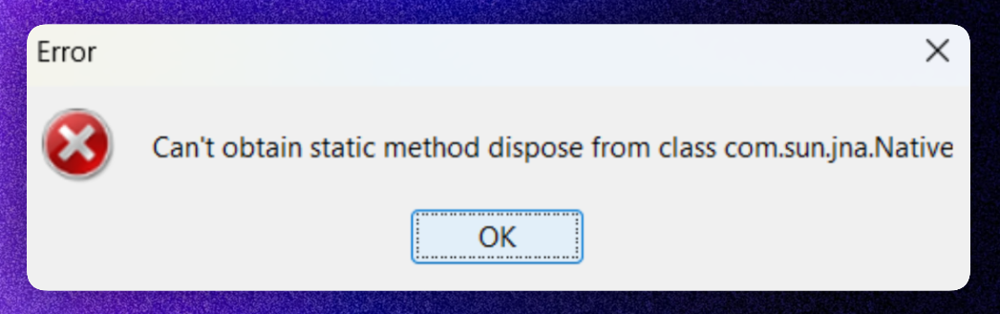
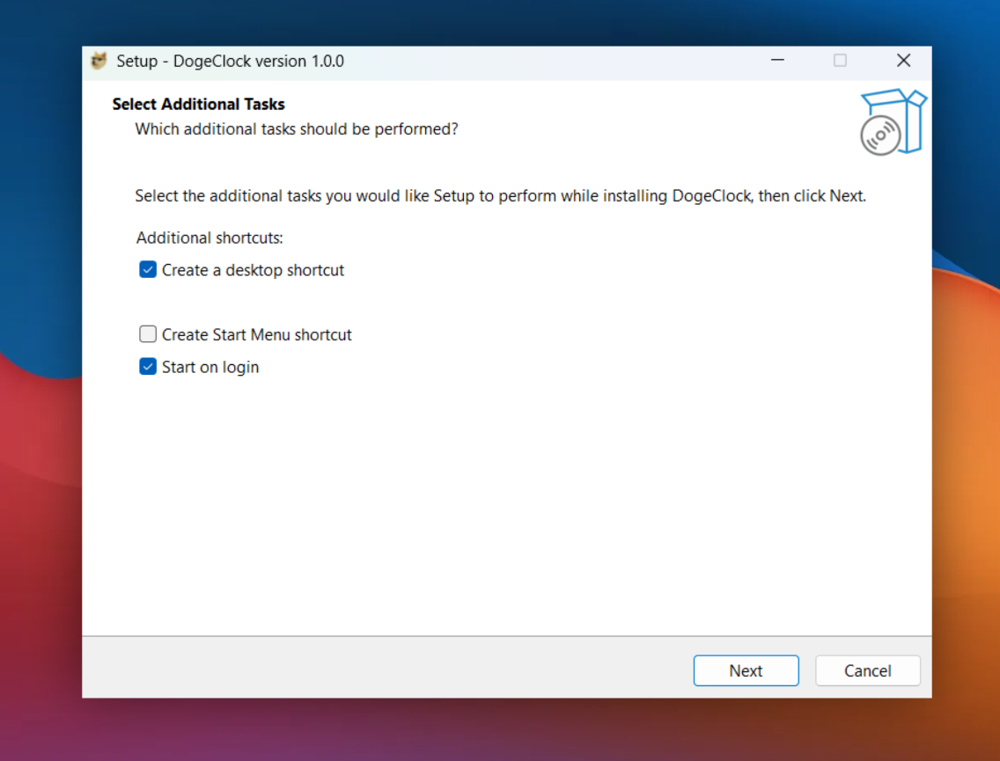

Not sure when it happened, but at some point I contracted this strange illness that compels someone to tinker with their OS on their spare time.

The latest symptom: a floating clock widget written in Powershell, that is visible at all times. (I hide my taskbar cause I pretend I'm a minimalist)

Since `Powershell` kinda sucks, I wondered if I could do the same with a proper Compose desktop app.

Let's lose a few braincells together, shall we?

### TL;DR

Code is on [GitHub](https://github.com/CostaFot/KMPClock) if you want to skip the post entirely and miss out on all the memes.



### Housekeeping

The [original PowerShell](https://github.com/CostaFot/windows-clock/blob/main/clock.ps1) implementation was about 100 lines. It consisted of a WPF window (_.NET Framework 3.0 circa 2006_ 😎):

-   With a transparent background
-   Using `WS_EX_TOOLWINDOW` to hide it from the taskbar
-   With a system tray icon
-   And the position saved to a JSON file

```powershell
// Talk to Windows UI layer
[DllImport("user32.dll")]

// Read the window style
GetWindowLong(windowHandle, EXTENDED_STYLE)

// Add the "hide from taskbar" flag and apply it
SetWindowLong(windowHandle, EXTENDED_STYLE, currentStyle | 0x80)
```

It really did work just fine as a classic caveman solution. 🧌



The Powershell script itself was abstracting out quite a lot of complexity. Technically we _could_ shove all of this into a single `.kt` file and call it a day.

But where's the fun in that?

If we are to do this the right™ way, it's worth mapping out what we actually need to replicate.



### Setting up the window

By default, the [KMP project template](https://kmp.jetbrains.com/?desktop=true&includeTests=true) gives us a basic window with title and controls.



We need to kill the title bar, make the background transparent, keep it always-on-top, and make the whole surface draggable since there's no title bar to grab.

```kotlin
Window(
    // ....
    undecorated = true, // kills the OS title bar
    transparent = true, // makes the window background see-through
    resizable = false,
    alwaysOnTop = true,
    // ....
) {
    WindowDraggableArea { // since there's no title bar to drag, this wraps the content and handles it
        App()
    }
}
```

*window.kt*

### The widget

The original had a semi-transparent rounded black pill with white text. We do not care about system theme and other niceties, let's just hardcode values here.

```kotlin
@Composable
fun ClockWidget(viewModel: ClockViewModel = koinViewModel()) {
    val time by viewModel.time.collectAsState()

    Box(
        modifier = Modifier.fillMaxSize(),
        contentAlignment = Alignment.Center,
    ) {
        Box(
            modifier = Modifier
                .clip(RoundedCornerShape(6.dp))
                .background(Color(0x99000000))
                .padding(horizontal = 6.dp, vertical = 2.dp),
            contentAlignment = Alignment.Center,
        ) {
            Text(
                text = time,
                color = Color.White,
                fontSize = 16.sp,
            )
        }
    }
}
```

*ClockWidget.kt*

Since we got `Koin` for dependency injection, it would be convenient to abstract away the timer in the `ClockViewModel`.

As is usually the case, these fun weekend side projects that are supposed to be _super easy_ always end up exposing a weakness or a misconception I have. Can you spot it?

```kotlin
class ClockViewModel : ViewModel() {
    // ....
    init {
        viewModelScope.launch {
            while (true) {
                delay(60.seconds)
                _time.value = LocalTime.now().format(formatter)
            }
        }
    }
    // ...
}
```

*ClockViewModelInitial.kt*

### Why not a plain 60-second delay?

If the app starts at `12:34:45`, a 60-second delay fires at `12:35:45`. The clock is then permanently 45 seconds late, which rather defeats the point of a clock.

The fix: work out how long is left until the next minute, delay by that, then carry on with the plain 60-second loop.

```kotlin
init {
    viewModelScope.launch {
        while (true) {
            delay((60 - LocalTime.now().second) * 1000L)
            _time.value = LocalTime.now().format(formatter)
        }
    }
}
```

*ClockViewModel.kt*

### Going down the Windows Native rabbit hole

By default, Compose Desktop windows show up in the taskbar.



Wait a minute! We want it to behave like a system tray utility, not a regular app window. 💢

Here's where it gets interesting though. The PowerShell script hid the window from the taskbar using `SetWindowLong` with `WS_EX_TOOLWINDOW` (`0x80`). A straight up native Windows API call.

In Kotlin, we can do this via [Java Native Access](https://mvnrepository.com/artifact/net.java.dev.jna/jna) – a library that lets JVM languages call native OS functions without writing any C code.



Now that we know the mapping, writing the code is straightforward enough.

```kotlin
// Define which Windows functions we need
internal interface User32 : Library {
    fun FindWindowA(className: String?, windowTitle: String?): Pointer?
    fun GetWindowLongA(hwnd: Pointer, index: Int): Int
    fun SetWindowLongA(hwnd: Pointer, index: Int, newStyle: Int): Int
}

class WindowsWindowStyleHelper : WindowStyleHelper {
    // JNA loads the actual Windows DLL at runtime
    val user32 = Native.load("user32", User32::class.java)

    override fun hideFromTaskbar(windowTitle: String) {
        val hwnd = user32.FindWindowA(null, windowTitle) ?: return
        val style = user32.GetWindowLongA(hwnd, GWL_EXSTYLE)
        user32.SetWindowLongA(hwnd, GWL_EXSTYLE,
            (style or WS_EX_TOOLWINDOW) and WS_EX_APPWINDOW.inv()
        )
    }
}
```

*WindowsWindowStyleHelper.kt*

This is where Koin earns its place. Overkill for a clock widget — and honestly it still is — but swapping the implementation per platform is now a one-liner.

macOS or Linux would just need their own `WindowStyleHelper` and one more line here.

```kotlin
val appModule = module {
    single<WindowStyleHelper> {
        if (System.getProperty("os.name").startsWith("Windows")) {
            WindowsWindowStyleHelper()
        } else {
            // provide macOS or Linux implementations below
        }
    }
}
```

*AppModule.kt*

### Configuring the system tray

With the window hidden from the taskbar, we now need a way to actually control it. That's where `androidx.compose.ui.window.Tray` comes in.

```kotlin
Tray(
    icon = clockIcon(),
    tooltip = "DogeClock",
    menu = {
        Item(if (isVisible) "Hide" else "Show", onClick = { isVisible = !isVisible })
        Separator()
        Item("Exit", onClick = ::exitApplication)
    },
)
```

*Tray.kt*

Show, hide, exit. That's all it needs.



### What about position persistence?

The window position gets saved to a plain JSON file — no permissions required.

On the next launch it reads it back and restores exactly where it was left. `kotlinx.serialization` keeps everything strongly typed, which is always nice.

```kotlin
@Serializable
private data class PositionConfig(val x: Float, val y: Float)

class PositionRepository {
    fun loadPosition(): WindowPosition? {
        if (!configFile.exists()) return null
        return try {
            val config = Json.decodeFromString<PositionConfig>(configFile.readText())
            WindowPosition(config.x.dp, config.y.dp)
        } catch (e: Exception) {
            null
        }
    }
}
```

*PositionRepository.kt*

### Proguard madness

After building the **release** variant of the app – via `./gradlew :composeApp:packageReleaseMsi` – with obfuscation enabled, I ran into all sorts of crashes.



*Can't obtain static method dispose from class com.sun.jna.Native*

Apparently, [Java Native Access](https://mvnrepository.com/artifact/net.java.dev.jna/jna) works via reflection. ProGuard was a bit too agressive stripping/renaming JNA stuff that is needed at runtime for native platform access.

The "fix" is to add the rules to `proguard-rules.pro`:

```
-dontwarn java.awt.*
-keep class com.sun.jna.* { *; }
-keep class * extends com.sun.jna.* { *; }
-keepclassmembers class * extends com.sun.jna.* { public *; }
```

And then wire it up in the gradle file:

```kotlin
buildTypes.release.proguard {
    configurationFiles.from("proguard-rules.pro")
}
```

To be honest, ProGuard here seems way more trouble than it's worth. I cannot imagine myself trusting it fully on a desktop app.

### Publishing this masterpiece of software engineering

Three Gradle tasks, one for each platform:

```bash
# Windows
./gradlew :composeApp:createReleaseDistributable

# Linux
./gradlew :composeApp:packageReleaseDeb

# macOS
./gradlew :composeApp:packageReleaseDmg
```

The Windows distributable gets wrapped into an installer via [Inno Setup](https://jrsoftware.org/isinfo.php) — a scriptable installer builder that's been around since forever.

No admin rights, opt-in shortcuts, start on login — and it's already on `windows-latest` runners so nothing to install.



### Anyways

I think I've contracted a new addiction writing KMP desktop apps now.

Hope you found this somewhat useful.

[@markasduplicate](https://x.com/markasduplicate)

Later
