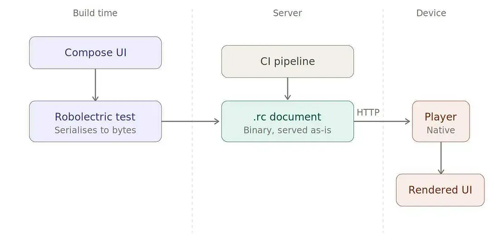
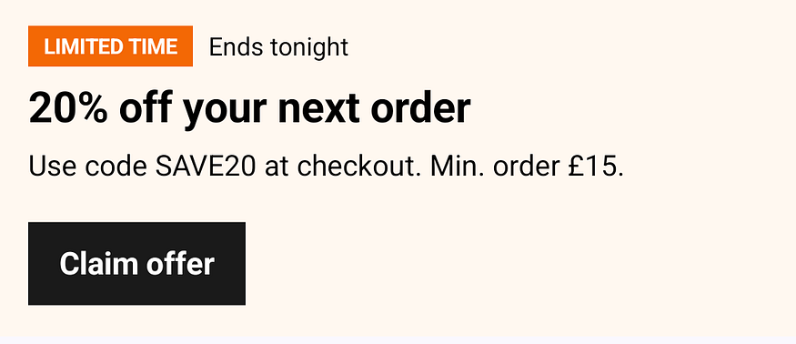
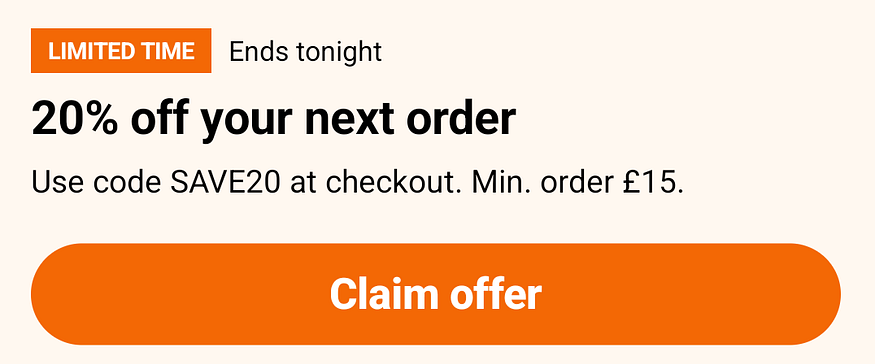
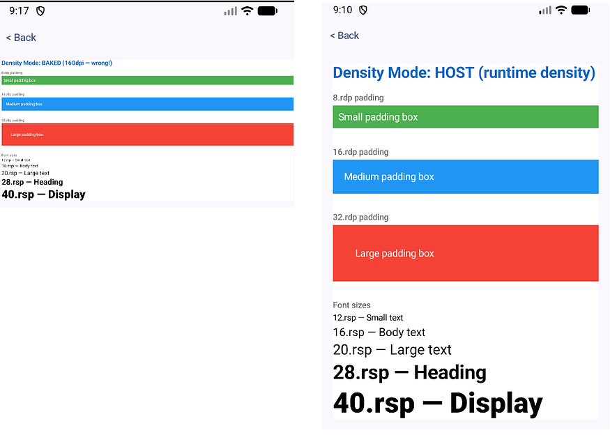
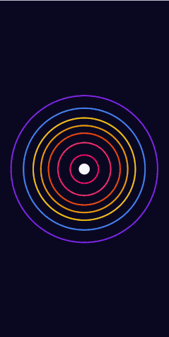
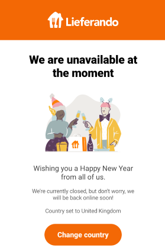

> [This post was originally published on the Just Eat Takeaway blog](https://medium.com/justeattakeaway-tech/remote-compose-looks-promising-7a87ffdb505f)

Just Eat Takeaway (JET) is a global food delivery network handling millions of active users across numerous markets. Operating at this scale requires flexibility on the client side to avoid the natural bottleneck of Play Store rollouts.

To get around this, we have a fair few UI components that need to change without shipping a release — offer cards, promo banners, offline and holiday screens, random little UI experiments — you get the picture.


Today, these are powered by the typical technologies:

-   Some form of server-driven UI
-   Branching code paths backed by an in-house feature management SDK
-   … and embedded `WebViews` (HTML/CSS/JS templates within native `Webview` containers).

While `WebViews` do work, the downsides are familiar: they don’t quite match a native look and feel, there’s performance overhead, interactions need bridging, and the dev model is different from the rest of the app.

But then [Remote Compose](https://developer.android.com/jetpack/androidx/releases/compose-remote) came into the picture. For the uninitiated, Remote Compose serializes UI nodes into a binary format that can be sent over the wire and rendered **natively**.

Granted, it is still in early `alpha` but it also is very much **open source**. Why not have a look and see if it could suit the needs of a typical business?

> ⚠️ At the time of writing, remote compose is on [1.0.0-alpha11](https://developer.android.com/jetpack/androidx/releases/compose-remote#1.0.0-alpha11) ⚠️



### The basics

Remote Compose closely mirrors the current Compose API.

```kotlin
RemoteRow(
verticalAlignment = RemoteAlignment.CenterVertically,
horizontalArrangement = RemoteArrangement.spacedBy(8.rdp),
) {
    RemoteBox(
        modifier = RemoteModifier
            .background(Color(0xFFF36805))
            .clickable(hostAction("my_action".rs))
            .padding(horizontal = 8.rdp, vertical = 4.rdp),
    ) {
        RemoteText(
            text = "LIMITED TIME".rs,
            color = RemoteColor(Color.White),
            fontSize = 11.rsp,
            fontWeight = FontWeight.Bold,
        )
    }
    RemoteText(
        text = "Ends tonight".rs,
        color = RemoteColor(Color.Black),
        fontSize = 13.rsp,
    )
}
```

*sample.kt*

This instantly looks familiar, even if it’s exclusively using remote compose.

Two main conventions:

-   `.rs`/`.rdp`/`.rsp` build remote strings, dp, and sp
-   `hostAction` tags a clickable element with a name the host catches later


### Generating a document

Let’s start with a naive implementation, then ramp up to something that will _hopefully_ be close to production level.

The POC has two halves: a Robolectric test that generates the document, and an app that renders it.

The test runs the composition and writes the bytes; the file is served as-is to whoever requests the URL.

```kotlin
@RunWith(RobolectricTestRunner::class)
@Config(sdk = [35])
class OfferDocument {
    @Test
    fun generateOfferDocument() {
        val context = ApplicationProvider.getApplicationContext<Context>()
        val displayInfo = RemoteCreationDisplayInfo(...)

        val doc = runBlocking {
            captureSingleRemoteDocument(
                context = context,
                creationDisplayInfo = displayInfo,
            ) {
                RemoteBox() {
                    RemoteColumn() {
                        ....
                        // Headline
                        RemoteText()
                        // Description
                        RemoteText()
                        // CTA
                        RemoteBox() { ... }
                        .... 
                    }
                }
            }
        }
        File("../output/offer.rc").apply { parentFile?.mkdirs() }.writeBytes(doc.bytes)
    }
}
```

*OfferDocumentV2.kt*

### Rendering

First, we need to load the actual document from a remote URL — I’m sure using plain `java.net.URL` will not be controversial.

```kotlin
var documentState by remember(url) { mutableStateOf<DocumentState>(DocumentState.Loading) }

LaunchedEffect(url) {
    documentState = try {
        val bytes = withContext(Dispatchers.IO) {
            URI.create(url).toURL().openStream().use { it.readBytes() }
        }
        val doc = RemoteDocument(bytes)
        DocumentState.Success(doc)
    } catch (e: Exception) {
       ..////
    }
```

*download.kt*

Then pass that variable into the `RemoteDocumentPlayer`. From there, we can catch that `claim_offer` action by name in `onNamedAction`:

```kotlin
@Composable
fun RemoteDocumentScreen(url: String) {
    // ... load bytes into RemoteDocument(bytes)
    BoxWithConstraints(Modifier.fillMaxSize()) {
        RemoteDocumentPlayer(
            document = documentState.document,
            documentWidth = maxWidth.value.toInt(), 
            documentHeight = maxHeight.value.toInt(),
            modifier = Modifier.fillMaxSize(),
            onNamedAction = { name, value, _ ->
                if (name == "claim_offer") { /* deep link, analytics, etc */ }
            },
        )
    }
}
```

*RemoteDocumentScreen.kt*

The result itself is already not _too_ bad.



### Getting fast iterations

One of the biggest benefits of working with Compose is the fast dev/debug loop cycles via `@Preview`.

Here, it's `RemoteDocumentPreview` instead. The generated documents can always be loaded manually. 👷

```kotlin
@Preview(showBackground = true, widthDp = 400, heightDp = 700)
@Composable
fun OfferPreview() {
    RemoteDocumentPreview(loadRemoteDocument("offer.rc"))
}

private fun loadRc(name: String): ByteArray {
    val file = File("${BuildConfig.OUTPUT_DIR}/$name")
    check(file.exists()) {
        "Could not find $name at ${file.absolutePath}. Run ./gradlew :producer:testDebugUnitTest first."
    }
    return file.readBytes()
}
```

*preview.kt*

Or we can just load these files over HTTP. `push` → GitHub Action runs the generator tests → `.rc` files land on `gh-pages` → served at a stable URL.

Locally, spinning up a local server via `python -m http.server 8080 --directory output` gives the same thing.

### Implementing a design system

At JET, we have our own design system called [PIE](https://pie.design/). Think of it like our own version of [Material](https://m3.material.io/).

To that end, an internal Android library of ready-made foundational components (buttons, cards, tags, typography) is provided, that every dev drops in without ever thinking about styling.

The problem is that this library emits standard Compose nodes the serializer will never understand. Since the design system exposes the tokens themselves, we can mirror them as constants and rebuild a few of the components we need as thin wrappers over the Remote Compose API.

```kotlin
@Composable
fun PieButton(
    text: String,
    action: Action,
    modifier: RemoteModifier = RemoteModifier,
) {
    RemoteBox(
        modifier = modifier
            .fillMaxWidth()
            .clip(RemoteRoundedCornerShape(RoundedE))
            .background(PieBrandOrange)
            .clickable(action)
            .rippleEffect(),
        contentAlignment = RemoteAlignment.Center,
    ) {
        RemoteText(
            text = text,
            color = RemoteColor(PieWhite),
            fontSize = FontSizeLabelL,
            fontWeight = FontWeight.ExtraBold,
            modifier = RemoteModifier.padding(
                horizontal = SpacingE,
                vertical = SpacingC,
            ),
        )
    }
}
```

*PieButton.kt*

Now the button looks _almost_ identical to the primary buttons provided by the PIE android library.



### What about fonts?

Custom fonts aren’t easily reachable from the Compose API currently. No matter what we tried, we could not make them load properly.

```kotlin
RemoteText(text = "Serif".rs, fontFamily = RemoteFontFamily.Serif)            // works
RemoteText(text = "PIE?".rs, fontFamily = RemoteFontFamily.Named("JetSans")) // falls back to Roboto
```

*fonts.kt*

The Compose player only matches a font name against `/system/fonts/`, so an app-bundled resource font is never found.

The path that is capable of supporting custom fonts is only reachable via the raw `RemoteComposeWriter`/ `RcPaint` canvas DSL, which bypasses the Compose layer entirely. (for now)

### Viewport size doesn’t matter?

We rendered the same document captured at five viewport sizes (from half a phone to a tablet) on one device.

```kotlin
val displayInfo = RemoteCreationDisplayInfo(
    width = ....,   
    height = ...., 
    densityDpi = ..., 
)
```

*RemoteCreationDisplayInfo.kt*

They all looked identical in the end, which, looking at the source code, seems to be by design.

The player re-measures the layout tree against its own Canvas size before every paint. The capture-time `width`/`height` only affect the composition phase, e.g. initial text wrapping.

### Density is confusing

While a document is recorded with a **set** density, there is also the option of passing `RemoteDensity.Host` inside `captureSingleRemoteDocument`:

```kotlin
val displayInfo = RemoteCreationDisplayInfo(
    width = TODO,
    height = TODO,
    densityDpi = TODO
)

captureSingleRemoteDocument(
    creationDisplayInfo = displayInfo,
    remoteDensity = RemoteDensity.Host, // optional
) { /* ... */ }
```

*density.kt*

This encodes conversions as runtime expressions against the **player’s** density, instead of constants.

Let’s try an experiment. Record a document with **160 dpi baked-in** density, and one with `RemoteDensity.Host` and check the differences.



The baked-in density makes things look way too small on a modern, high density screen, which makes sense I guess.

While `RemoteDensity.Host` looks to be the right call and should _probably_ always be used, I ran into all sorts of crashes with it when making more complex layouts.

It seems only usable for the simplest flat layouts — `spacedBy`, `clip`, and `RemoteRoundedCornerShape` all trigger variants of the same underlying bug where host density variable expressions fail to evaluate. 😥

### Careful!

Elevation and shadows are supported but require a bit of extra work.

Unlike standard Compose where `Card` has a built-in `elevation` parameter, Remote Compose requires using the `graphicsLayer` modifier with `shadowElevation` and a `shape` to produce shadows:

```kotlin
RemoteBox(
    modifier = RemoteModifier
        .fillMaxWidth()
        .graphicsLayer(
            shadowElevation = 4f.rf,
            shape = RoundedCornerShape(RoundedC),
        )
        .clip(RemoteRoundedCornerShape(RoundedC))
        .background(PieContainerDefault),
) { /* card content */ }
```

*elevation.kt*

### Theming and localisation

It should be apparent by now that everything in the examples above— colours, strings, images — is **baked in at capture time**. No runtime theming or localisation.

One way to get around that is by **generating a document per variant and letting the client request the right one.**

```kotlin
// strings and colours are literals in the binary, so you generate per combination
for (locale in listOf("en", "nl", "de")) {
    generateDocument(LightTokens, strings(locale), "promo_light_$locale.rc")
    generateDocument(DarkTokens,  strings(locale), "promo_dark_$locale.rc")
}
```

*variant.kt*

The app requests what it needs (`?theme=dark&locale=nl`) and the backend returns the matching binary.

This is definitely **not** pretty, and also introduces many variants per document (n themes × n locales).

The **other way** of working around this is by leveraging Remote Compose state management. For example, using `rememberNamedRemoteString` , the host can inject a value by name at runtime:

```kotlin
// 1. Declare the string with a name and a fallback default
val offerTitle = rememberNamedRemoteString("offer_title", "Default Title")

// 2. Use it like any other string in your Remote Compose UI
RemoteText(
    text = offerTitle,
    ....
)

// 3. At render time, the host app injects the real value by name
player.setUserLocalString("offer_title", "🔥 HOT DEAL")
```

*rememberNamedRemoteString.kt*

There’s also equivalents for `int` , `float` etc.

Try as I might, I could not get this to work properly unfortunately. The text was never updated successfully. I assume this will be fixed down the line as it’s still early days. 🫡

### Animation comes for free

The binary can encode time-based expressions the player evaluates per frame — so a _static_ `.rc` file can animate.

For us that means animated offer cards — pulsing highlights, countdowns, progress — with no app code changes.

The sky seems to be the limit here. I can imagine plenty of creative usages down the line, like [this](https://gist.github.com/costafotjet/53d4ec648c752aa1a4bd13f3437ec8a5) one for example:



### Images

Most images can be converted to bitmaps and embedded straight into the binary:

```kotlin
@RunWith(RobolectricTestRunner::class)
@Config(sdk = [35])
@GraphicsMode(GraphicsMode.Mode.NATIVE)
class BakedInImageDocument {
    @Test
    fun generateBakedInImage() {
        val context = ApplicationProvider.getApplicationContext<Context>()
        val displayInfo = RemoteCreationDisplayInfo(..)

        val imageBitmap = BitmapFactory.decodeFile("../images/custom_image.jpg").asImageBitmap()

        val doc = runBlocking {
            captureSingleRemoteDocument(...) {
                RemoteBox(..) {
                    RemoteImage(
                        bitmap = imageBitmap,
                        contentDescription = "€10 off your first order".rs,
                        contentScale = ContentScale.FillWidth,
                        modifier = RemoteModifier.fillMaxWidth(),
                    )
                }
            }
        }
        File("../output/baked_in_image.rc").apply { parentFile?.mkdirs() }.writeBytes(doc.bytes)
    }
}
```

*BakedInImageDocument.kt*

As for URL images; they seem broken in the current alpha. `rememberNamedRemoteBitmap(name, url)` declares 1x1 dimensions internally, so the player throws `"dimensions don't match"`.

### Going further

The logical conclusion to all this is that we can even provide [full-screen components](https://gist.github.com/costafotjet/18b3da3dc5121569bfd7e0e8002ac81c).



While I’m not convinced this will _ever_ be a good idea, fully replicating entire layouts in Remote Compose looks highly feasible in the future when the API is more stable.

### **What works well**

-   **Native performance** — Compose Canvas directly, no `WebView` overhead.
-   **Design system fidelity** — colours, spacing, shapes reproduce cleanly
-   **Server-driven updates** — new UI with no release.
-   **Animation & interaction** — time expressions and `hostAction` both work well.
-   **Testability** — documents come out of unit tests.

### **Questionable**

-   **Adaptive layout** — `RemoteDensity.Host` + the player's re-measure mean one file _should_ fit any density and size, but it’s still tricky to figure out how it all works in combination with modifiers.
-   **URL images seem broken**
-   **No custom fonts via the Compose API** — brand fonts need the lower-level writer.
-   **Limited primitives** — Column/Row/Box only; no `LazyColumn` or other cool stuff
-   **Alpha** — unstable API, `@RestrictedApi` everywhere; accessibility unproven.

And the elephant in the room: **no multiplatform support. 🐘**

All this is **Android only**. As-is, that’s the biggest blocker, more than the alpha API or missing features.

> Multiplatform support has been mentioned on the Kotlin Slack channel, but for now, the library is just too early in its lifecycle.

### Wrap up

As the title suggests, this all looks quite promising. If you are interested, there is also a [great presentation on Youtube](https://youtu.be/2O-uClv9R3o?si=VVEQsEgQR6nH8ohm) from the creators of Remote Compose @ Google.

Looking forward to future updates with a stable API, some nice docs and hopefully multi-platform support. We will definitely give it a go in production when things settle.
