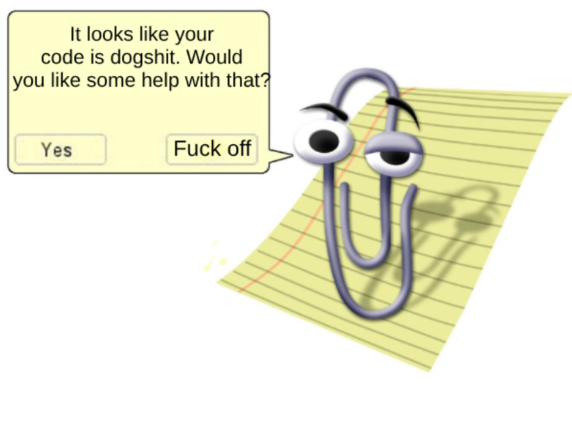
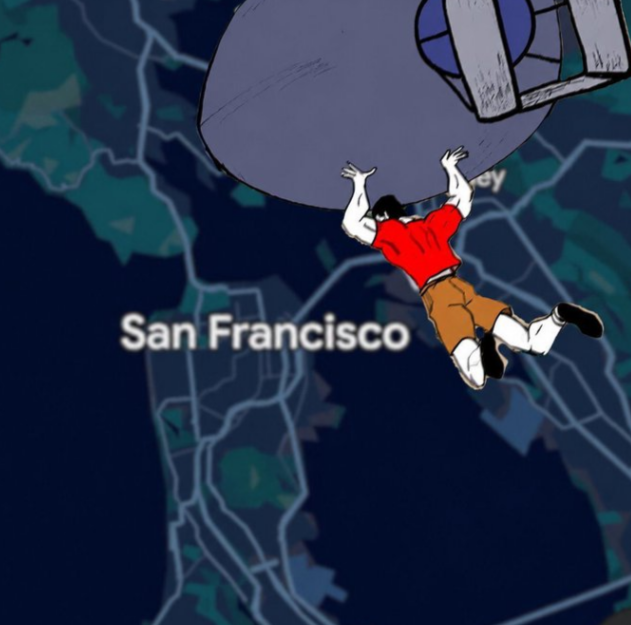
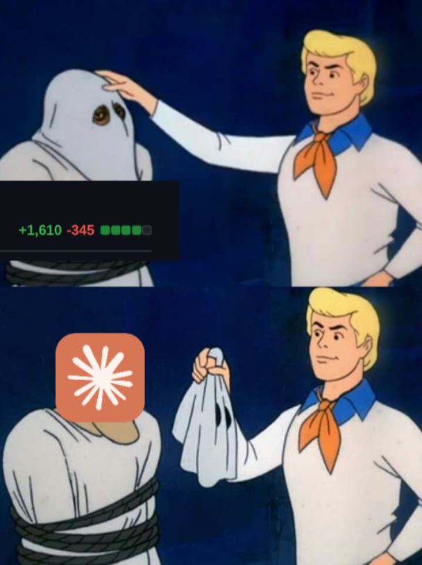
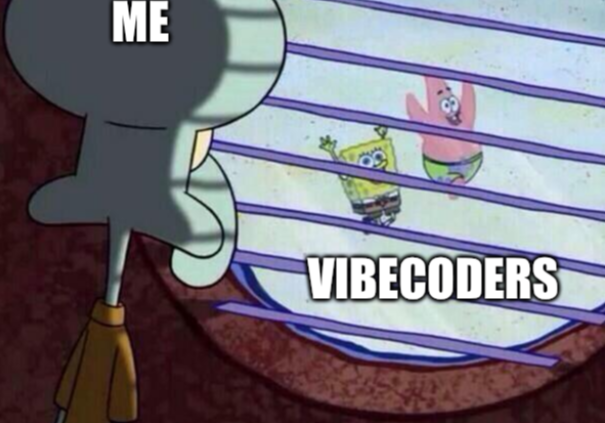
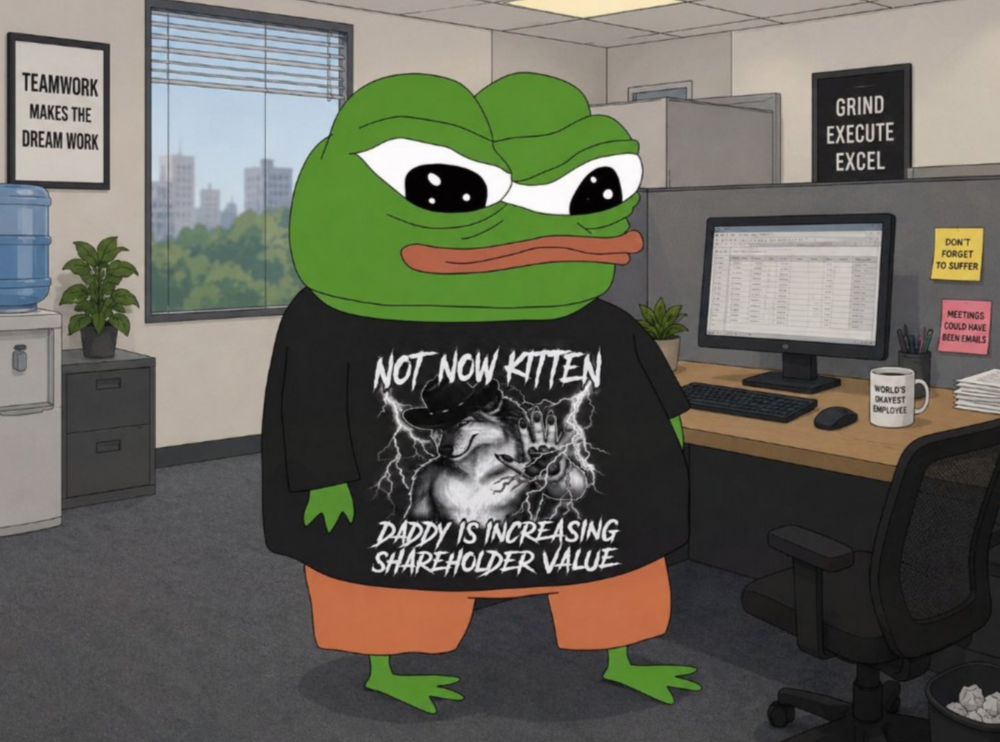
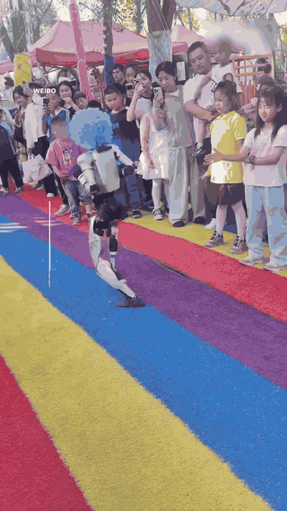

Now that most of us are fully in the "Acceptance" stage, I thought it would be fun to look back on the past 3-4 years of this madness from the perspective of a typical individual shipping code in a — surprise! — typical corporate environment.

## #1. denial

Image generation was the first to actually get quite good. *DALL·E 2*, *Midjourney* and others that have long been forgotten. I distinctly remember **paying** for *Midjourney* and having a mini-psychotic episode generating 100 images of questionable art late at night.

It didn't last long. Once the novelty wore off I put it on the side as a fun little experiment and nothing more. Meanwhile, artists were, unbeknownst to me, speedrunning the stages of grief. 💀

Then came the Will Smith spaghetti memes. It was fun and kinda scary. No one really knew what to make of it besides memeing about it.

## #2. anger

Around the same time, we got the AI autocomplete/chat onslaught for coding. Copilot, Cody, Codeium, JetBrains AI Assistant, Google's Studio Bot in Android Studio... do I need to go on?

Frankly, the autocomplete phase was absolute crap.

It got in the way like a nagging Clippy (let me write my code!), and its suggestions were always hit and miss. In the end, I ended up turning off **all** autocomplete AI suggestions as they did more harm than good. I "knew" what I was doing and this stupid AI was getting in the way.

But, the chatbots themselves became useful real fast. No longer would I need to suffer through Stack Overflow! I had enough of that place and its stupid moderators. Good riddance. 🫡

## Intermission

By mid-2025, I was still writing 99% of code by hand. But AI was such a great accelerator in other aspects of the job that it was difficult to imagine a time before it. I tried the new models, tools and anything else I could get my hands on, but these models were **still** not good enough to make me put down the keyboard and stop writing code by hand.

In the meantime, the AI hypesters really did not do themselves any favors. What a ridiculous space this is. I had difficulty listening to these people, even if I found figments of truth beneath the veneer of ridiculousness, unlike the crazy Crypto bubble of 2021. (anyone remembers NFTs?)

Working for a large company for years, you start building up an intuition on the way things are. You are very cognizant of the "pulse", for lack of a better term. The code you see on pull requests, PR frequency, how many times you get asked about random things on Slack and by who, who needs help, who is the boss, who is a pro, who can be trusted.. you get the point.

All these would be challenged next.

## #3. bargaining

Opus 4.5 happened late 2025 — needless to say, it sent me straight into the bargaining phase.

* "It is good, but I think I'm better"
* "It writes too many comments"
* "It's good on web-slop but not on Android!"

.. these and similar coping lines were on repeat for a few months. Meanwhile, newer models were showing up on a weekly basis, each one better than the last.

At the same time, people stopped asking me questions about the codebase. Actually, they stopped asking me questions about code — **period**. That was 50% of my imaginary usefulness out the door then and there! 😂

Pull requests were also coming in hard and fast. Who were these people?! Certainly not the colleagues I knew. Claude was **everywhere**. I diligently kept reviewing PRs, still stuck in the past as my brain kept resisting what it was seeing.

Which takes us to...

## #4. depression

By March 2026, my brain was broken. I hadn't manually written code for weeks, yet I was as productive as I had always been in my role. But the scope of things I was capable of now was *10x* greater. Web? No problem. Analytics? Sure. Something I just heard about 10 minutes ago? Give me a few hours and I can surely do something with it. (with the help of Claude, of course)

I wasn't enjoying **any** of it.

The act of writing code and thinking through a problem **was** the reward. It has been for years! Money and food on the table certainly help, but there was something there that satisfied an itch that no money could fix.

## #5. acceptance

The Fable 5/Astra 6/Opus 5.5 final gut punch has made it evident that the job is no longer the same. Most of the jobs out there are a few prompts away and this train is not stopping.

I had so much fun writing code by hand. That time is mostly over.

I also have so much fun making things that are funny, silly, useful and/or a combination of all 3. Hopefully some make money too. 🤑

## Anyways

It was not that long ago mobile dev was a nascent industry breaking developers' brains. People who pivoted and took advantage of this new space found ample opportunity for many years, myself included.

This one feels more akin to the internet bubble. But it's anyone's guess where we will end up. I for one cannot wait to get my ass whooped by a clanker in 2030. 👇

_(if you liked this post, why not click the_ 🍺 _button below?)_

[@markasduplicate](https://x.com/markasduplicate)

Later.
